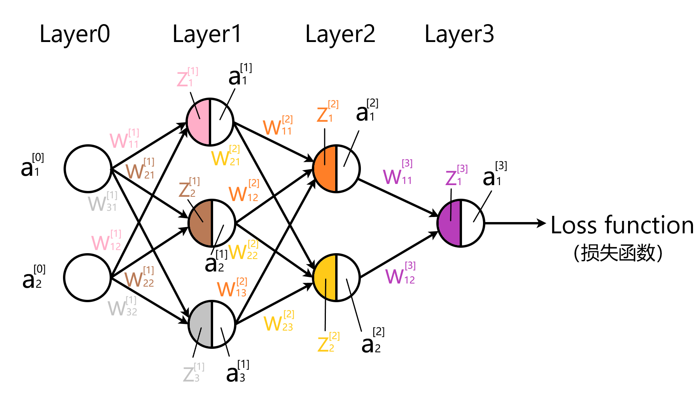
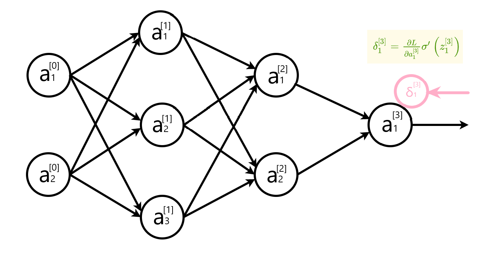
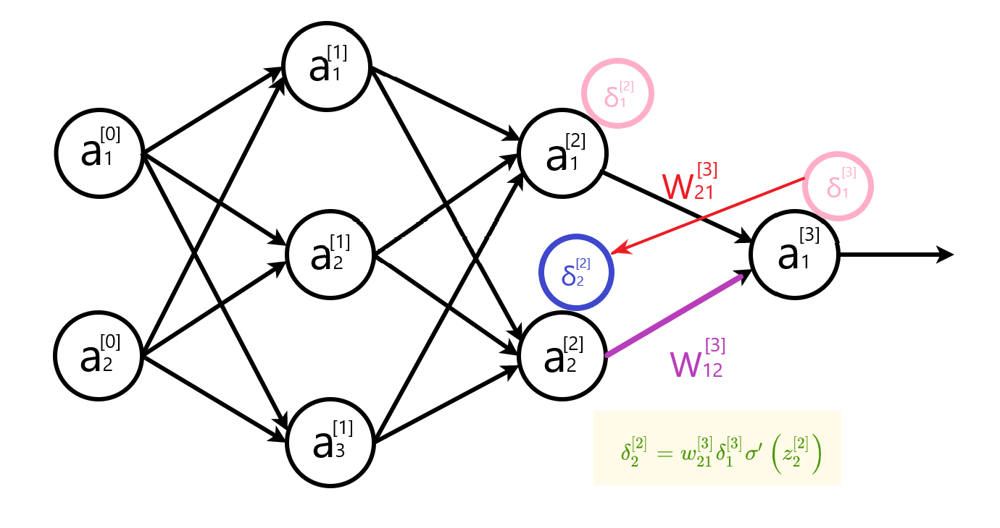
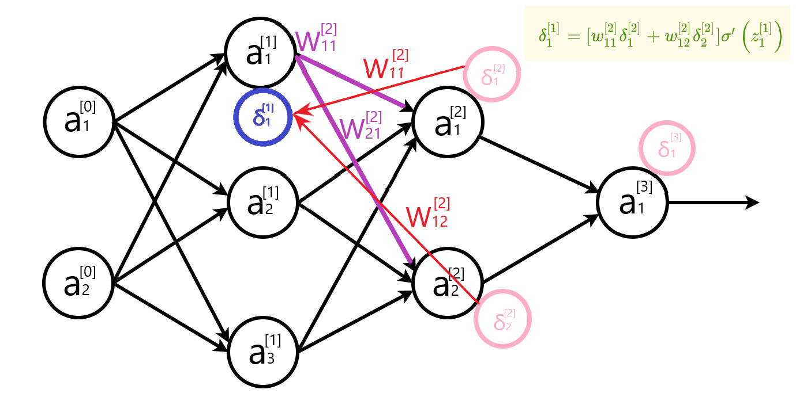
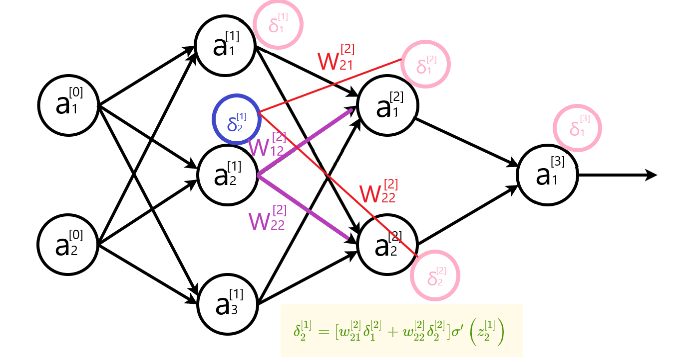
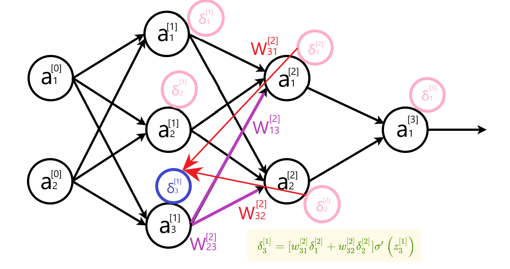
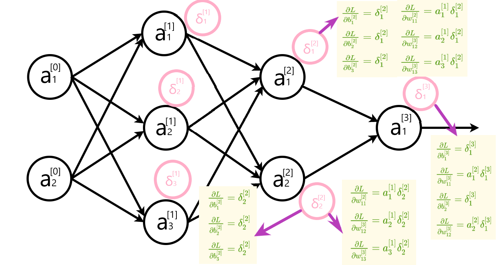

# 基于符号的机器学习

> 概念学习的目的，就是让你从训练样本集D中来去归纳演绎出一般规律，来覆盖假设空间H。从一般（general）到特殊（special）是概念学习的精髓所在

<ϕ,ϕ,ϕ,ϕ,ϕ>最特殊序列
< ?,?,?,?,? > 是最一般序列

### 假设空间

设置归纳偏置，对应两假设$存在偏序关系：h_j(x) ≥_g h_k(x) $，那么我们就称$j比k$更一般

### 变形空间

用训练样本集D去逼近假设空间H

 假设$h \in H $与训练样本集D一致，当且仅当对于任意样例$< x , c ( x ) > \in D$都有$h ( x ) = c (x)$

如果我们对于任意的$h \in H$都能保证与D 一致，那么，我们也就能说样本集D（一致）逼近到了H上。我们将上述一致形成的集合空间表示出来,形成了变形空间

**变形空间**覆盖了 **目标概念c(x)** 中所有合理的变形，也就是说它包含了**最佳假设**，$V S_{H,D} \equiv \{h \in H | h一致于D\}$

> 边界的约束就取决于H**与**D相一致的极大一般集合和极大特殊集合(可以理解成上下确界)，也就是VS必须包含D中所有正例，而抑制D中所有反例

### Find-s

只通过正例来寻求**极大特殊集合****，**反例我可以直接无视

- step1 将h初始化为H中最特殊假设
- step2 使用每个正例，将h中属性替换为更一般的约束
- step3 输出h

### 候选消除算法

改进Find-s算法，寻找**极大一般边界**---考虑反例如何从空间中剔除

> 正例反例是合取关系：
> **正例一定得到的是最特殊的，反例剔除后得到的一定是最一般的**

> 将G集合初始化为H中极大一般假设
> 将S集合初始化为H中极大特殊假设

对每个训练例d，进行以下操作：

- 如果d是一正例
  - 从G中移去所有与d不一致的假设
  - 对S中每个与d不一致的假设s，将s替换成一般的“?”
  - 排除S中比S的其他假设更一般的假设
  - 排除S中比G中更一般的假设

- 如果d是一个反例 
  - 从S中移去所有d一致的假设
  - 对匹配d的G中g，用不匹配d的最一般特化?来替换g
  - 排除G中比G其他假设更特殊的假设
  - 排除G中比S中更特殊的假设

### ID3算法

#### 决策树

一种树形结构，其组成包括结点(node)和有向边(directed edge)。而结点有两种类型，分别是内部结点(internal node)和叶结点(leaf node)。其中每个内部结点表示一个属性（特征），每个叶节点表示一个类别

#### 熵值计算

熵：$H=-\Sigma_{i=1}^{n}P(x_i)log_2P(x_i)$

经验熵：$H(D)=-\Sigma_{k=1}^{K} \frac{|C_k|}{|D|}log_2{\frac{|C_k|}{|D|}}$

条件熵：$H(Y|X)=\Sigma_{i=1}^{n}p_iH(Y|X=x_i)$

信息增益：集合D的经验熵H(D)与特征A给定条件下D的经验条件熵H(D|A)之差
$g(D,A)=H(D)-H(D|A)$

#### 执行过程

1. 收集数据：可以使用任何方法
2. 准备数据：树构造算法只适用于标称型数据，因此数值型数据必须离散化
3. 分析数据：可以使用任何方法，构造树完成之后，我们应该检查图形是否符合预期
4. 训练算法：构造树的数据结构
5. 测试算法：使用经验树计算错误率
6. 使用算法：此步骤可以适用于任何监督学习算法，而使用决策树可以更好地理解数据的内在含义


### 基于符号学习的系统空间架构


1. 学习任务的数据和目标
2. 所学知识的表示
3. 操作的集合
4. 概念空间
5. 启发式搜索

# 连接机制

## MP感知机

只有一层神经网络，输入输出值都是1或-1，权重和=$\Sigma x_iw_i$

如果权重和大于等于阈值函数，输出1；反之输出-1
因此期望值和实际值的差值为0或2

权值分量$\Delta(w_i)=c(d-sign(\Sigma x_iw_i))x_i$(d是期望输出，c是常数--学习率)
权值向量分量：

* 期望==输出，权值不变
* 期望是1而输出-1，对第i个分量增加$2cx_i$
* 期望是-1而输出1，对第i个分量减少$2cx_i$

这个过程不断地减少训练集和的平均误差

> 感知机不能解决非线性可分问题

过程：

* 从可能的问题空间中选择原始数据，然后变换成新的数据/模式空间
* 在这新的模式空间中，空间特征被确定
* 对这些特征所表示的实体分类


## $BP$神经网络

### 1.激活函数

激活函数（Activation Function）是在人工神经网络的神经元上运行的函数，负责将神经元的输入映射到输出端。激活函数对于人工神经网络模型去学习、理解复杂的非线性函数，具有十分重要的作用。
	
如果不使用激活函数，每一层输出都是上一层输入的线性运算，无论神经网络有多少层，最终的输出只是输入的线性组合，相当于感知机。如果使用了激活函数，将非线性因素引入到网络中，使得神经网络可以任意逼近任何非线性函数，能够应用到更多的非线性模型。


**$sigmoid$ 函数**

$Sigmoid$函数是一个在生物学中常见的S型函数，也称为S型生长曲线。在信息科学中，由于其单增以及反函数单增等性质，Sigmoid函数常被用作神经网络的阈值函数，将变量映射到0,1之间，公式如下：
$$
f(x)=\frac{1}{1+e^{(-x)}}
$$
**$ReLU$函数**

$Relu$激活函数（The Rectified Linear Unit），用于隐藏层的神经元输出。公式如下：
$$
f(x)=max(0,x)
$$
**$Tanh$ 函数**

$Tanh$ 是双曲函数中的一个，$Tanh()$ 为双曲正切。在数学中，双曲正切“$Tanh$”是由基本双曲函数双曲正弦和双曲余弦推导而来。公式如下：
$$
f(x)=\frac{e^{x}-e^{-x}}{e^{x}+e^{-x}}
$$
**$softmax$ 函数**

$softmax$ 函数用于输出层。假设输出层共有 $n$ 个神经元，计算第 $k$ 个神经元的输出 $y_k$。$softmax$ 函数的分子是输入信号 $a_k$ 的指数函数，分母是所有输入信号的指数函数的和。$softmax$ 函数公式如下：
$$
y_{k}=\frac{e^{a_{k}}}{\sum_{i=1}^{n} e^{a_{i}}}
$$


### 2.神经网络结构

第0层是输入层（2个神经元），第1层是隐含层（3个神经元），第2层是隐含层（2个神经元），第3层是输出层。




#### 符号约定

 $w_{j k}^{[l]}$表示从网络第$(l-1)^{t h}$ 层第$k^{t h}$ 个神经元指向第 $l^{t h}$ 层第 $j^{t h}$ 个神经元的连接权重，同时也是第 $l$ 层权重矩阵第 $j$ 行第 $k$ 列的元素。
例如，上图中 $w_{21}^{[1]}$ ，第0层第1个神经元指向第1层第2个神经元的权重（褐色），也就是第 1 层权重矩阵第 2 行第 1 列的元素。
同理，使用 $b_{j}^{[l]}$ 表示第 $l^{t h}$ 层第 $j^{t h}$ 个神经元的偏置 ，同时也是第 $l$ 层偏置向量的第 $j$ 个元素。
使用 $z_{j}^{[l]}$ 表示第 $l^{t h}$ 层第 $j^{t h}$ 个神经元的线性结果，使用 $a_{j}^{[l]}$ 来表示第 $l^{t h}$ 层第 $j^{t h}$ 个神经元的激活函数输出。
其中，激活函数使用符号σ表示，第 $l^{t h}$ 层中第 $j^{t h}$ 个神经元的激活为:
$$
a_{j}^{[l]}=\sigma(z_{j}^{[l]})=\sigma\left(\sum_{k} w_{j k}^{[l]} a_{k}^{[l-1]}+b_{j}^{[l]}\right)
$$
 $w^{[l]}$ 表示第 $l$ 层的权重矩阵，$b^{[l]}$ 表示第 $l$ 层的偏置向量，$a^{[l]}$ 表示第 $l$ 层的神经元向量，结合上图讲述：

$w^{[1]}=\left[\begin{array}{lll}w_{11}^{[1]} & w_{12}^{[1]} & \\ w_{21}^{[1]} & w_{22}^{[1]} & \\ w_{31}^{[1]} & w_{32}^{[1]}\end{array}\right]$ $w^{[2]}=\left[\begin{array}{lll}w_{11}^{[2]} & w_{12}^{[2]} & w_{13}^{[2]} \\ w_{21}^{[2]} & w_{22}^{[2]} & w_{23}^{[2]}\end{array}\right]$

$b^{[1]}=\left[\begin{array}{l}b_{1}^{[1]} \\ b_{2}^{[1]} \\  b_{3}^{[1]}\end{array}\right]$$b^{[2]}=\left[\begin{array}{l}b_{1}^{[2]} \\ b_{2}^{[2]}\end{array}\right]$

进行线性矩阵运算。

$z^{[1]}=\left[\begin{array}{lll}w_{11}^{[1]} & w_{12}^{[1]} & \\ w_{21}^{[1]} & w_{22}^{[1]} & \\ w_{31}^{[1]} & w_{32}^{[1]}\end{array}\right] \cdot\left[\begin{array}{c}a_{1}^{[0]} \\ a_{2}^{[0]}\end{array}\right]+\left[\begin{array}{l}b_{1}^{[1]} \\ b_{2}^{[1]} \\ b_{3}^{[1]}\end{array}\right]=\left[\begin{array}{c}w_{11}^{[1]} a_{1}^{[0]}+w_{12}^{[1]} a_{2}^{[0]}+b_{1}^{[1]} \\ w_{21}^{[1]} a_{1}^{[0]}+w_{22}^{[1]}a_{2}^{[0]}+b_{2}^{[1]} \\ w_{31}^{[1]}a_{1}^{[0]}+w_{32}^{[1]}a_{2}^{[0]}+b_{3}^{[1]}\end{array}\right]$

矩阵形状     (3,2)	  (2,1) (3,1) (3,1)


$z^{[2]}=\left[\begin{array}{ccc}w_{11}^{[2]} & w_{12}^{[2]} & w_{13}^{[2]} \\ w_{21}^{[2]} & w_{22}^{[2]} & w_{23}^{[2]}\end{array}\right] \cdot\left[\begin{array}{c}a_{1}^{[1]} \\ a_{2}^{[1]} \\ a_{3}^{[1]}\end{array}\right]+\left[\begin{array}{c}b_{1}^{[2]} \\ b_{2}^{[2]}\end{array}\right]=\left[\begin{array}{c}w_{11}^{[2]} a_{1}^{[1]}+w_{12}^{[2]} a_{2}^{[1]}+w_{13}^{[2]} a_{3}^{[1]}+b_{1}^{[2]} \\ w_{21}^{[2]} a_{1}^{[1]}+w_{22}^{[2]} a_{2}^{[1]}+w_{23}^{[2]} a_{3}^{[1]}+b_{2}^{[2]}\end{array}\right]$

矩阵形状(2,3) (3,1) (2,1) (2,1)


那么，前向传播过程可以表示为：
$$
a^{[l]}=\sigma\left(w^{[l]} a^{[l-1]}+b^{[l]}\right)
$$
上述讲述的前向传播过程，输入层只有1个列向量，也就是只有一个输入样本。对于多个样本，输入不再是1个列向量，而是m个列向量，每1列表示一个输入样本。m个$a^{[l-1]}$列向量组成一个m列的矩阵$A^{[l-1]}$。

$A^{[l-1]}=\left[\begin{array}{cccc}| & | & \cdots & | \\ a^{[l-1](1)} & a^{[l-1](2)} & \dots & a^{[l-1](m)} \\ | & | & \dots & |\end{array}\right]$

多样本输入的前向传播过程可以表示为：
$$
\begin{array}{c}
Z^{[l]}=w^{[l]} \cdot A^{[l-1]}+b^{[l]} \\
A^{[l]}=\sigma\left(Z^{[l]}\right)
\end{array}
$$
与单样本输入相比，多样本$w^{[l]}$和$b^{[l]}$的定义是完全一样的，不同的只是$Z^{[l]}$和$A^{[l]}$从1列变成m列，每1列表示一个样本的计算结果。

### 3.损失函数

在有监督的机器学习算法中，我们希望在学习过程中最小化每个训练样例的误差。通过梯度下降等优化策略完成的，而这个误差来自损失函数。
	
**损失函数**用于单个训练样本，而**成本函数**是多个训练样本的平均损失。优化策略旨在最小化成本函数。下面例举几个常用的损失函数。

#### 回归问题

1.  绝对值损失函数($L_{1}$损失函数)：

$L(\hat{y},y)=|y-\hat{y}|$

$y$ 表示真实值或期望值，$\hat{y}$ 表示预测值

2.  平方损失函数($L_{2}$损失函数)：

$L(\hat{y},y)=(y-\hat{y})^{2}$

$y$ 表示真实值或期望值，$\hat{y}$ 表示预测值

#### 分类问题

1. 交叉熵损失：

$L(\hat{y}, y)=-y \log (\hat{y})-(1-y) \log (1-\hat{y})$

$y$ 表示真实值或期望值，$\hat{y}$ 表示预测值


### 4.反向传播

反向传播的基本思想：通过计算输出层与期望值之间的误差来调整网络参数，使得误差变小(最小化损失函数或成本函数)。反向传播基于**四个基础等式**，非常简洁优美，但想要理解透彻还是挺烧脑的。

#### 求解梯度矩阵

假设函数 $f:R^{n \times 1} \rightarrow R$ 将输入的列向量（shape: $n \times 1$ ）映射为一个实数。那么，函数 $f$ 的梯度定义为：

$\nabla_{x} f(x)=\left[\begin{array}{c}\frac{\partial f(x)}{\partial x_{1}} \\ \frac{\partial f(x)}{\partial x_{2}} \\ \vdots \\ \frac{\partial f(x)}{\partial x_{n}}\end{array}\right]$

同理，假设函数 $f: R^{m \times n} \rightarrow R$ 将输入的矩阵（shape: $m \times n$ ）映射为一个实数。函数 $f$ 的梯度定义为：

$\nabla_{A} f(A)=\left[\begin{array}{cccc}\frac{\partial f(A)}{\partial A_{11}} & \frac{\partial f(A)}{\partial A_{12}} & \dots & \frac{\partial f(A)}{\partial A_{13}} \\ \frac{\partial f(A)}{\partial A_{21}} & \frac{\partial f(A)}{\partial A_{22}} & \dots & \frac{\partial f(A)}{\partial A_{2 n}} \\ \vdots & \vdots & \ddots & \vdots \\ \frac{\partial f(A)}{\partial A_{m 1}} & \frac{\partial f(A)}{\partial A_{m 2}} & \dots & \frac{\partial f(A)}{\partial A_{m n}}\end{array}\right]$

可以简化为：

$\left(\nabla_{A} f(A)\right)_{i j}=\frac{\partial f(A)}{\partial A_{i j}}$


注意：梯度求解的前提是函数 $f$ 返回的必须是一个实数，如果函数返回的是一个矩阵或者向量，是没有办法求解梯度的。例如，函数$f(A) =\sum_{i=0}^{m} \sum_{j=0}^{n} A_{i j}^{2}$，函数返回一个实数，可以求解梯度矩阵。如果 $f(x)=A x\left(A \in R^{m \times n}, x \in R^{n \times 1}\right),$ 函数返回一个m行的列向量，就不能对 $f$ 求解梯度矩阵。

**矩阵相乘**

矩阵 $A=\left[\begin{array}{cc}1 & 2 \\ 3 & 4\end{array}\right]$，矩阵 $B=\left[\begin{array}{cc}-1 & -2 \\ -3 & -4\end{array}\right]$

$A B=\left[\begin{array}{ll}1 \times-1+2 \times-3 & 1 \times-2+2 \times-4 \\ 3 \times-1+4 \times-3 & 3 \times-2+4 \times-4\end{array}\right]=\left[\begin{array}{cc}-7 & -10 \\ -15 & -22\end{array}\right]$

**矩阵对应元素相乘**

使用符号$\odot$表示：

$A \odot B=\left[\begin{array}{cc}1 \times-1 & 2 \times-2 \\ 3 \times-3 & 4 \times-4\end{array}\right]=\left[\begin{array}{cc}-1 & -4 \\ -9 & -16\end{array}\right]$


#### 反向传播图解

计算输出层误差



计算隐藏层误差




隐藏层误差公式写成矩阵形式  $\delta^{[l]}=\left[w^{[l+1]^{T}} \delta^{[l+1]}\right] \odot \sigma^{\prime}\left(z^{[l]}\right)$ 时， 权重矩阵需要转置。上面两幅图，直观地解释了转置的原因。







计算参数变化率



最后更新每层的参数。


#### 反向传播公式总结

##### 单样本输入公式表

|    说明    |                             公式                             |
| :--------: | :----------------------------------------------------------: |
| 输出层误差 | $\delta^{[L]}=\nabla_{a} L \odot \sigma^{\prime}\left(z^{[L]}\right)$ |
| 隐含层误差 | $\delta^{[l]}=\left[w^{[l+1]^{T}} \delta^{[l+1]}\right] \odot \sigma^{\prime}\left(z^{[l]}\right)$ |
| 参数变化率 | $\begin{array}{c}\frac{\partial L}{\partial b^{[l]}}=\delta^{[l]} \\\frac{\partial L}{\partial w^{[l]}}=\delta^{[l]} a^{[l-1] T}\end{array}$ |
|  参数更新  | $$\begin{array}{l}b^{[l]} \leftarrow b^{[l]}-\alpha \frac{\partial L}{\partial b^{[l]}} \\w^{[l]} \leftarrow w^{[l]}-\alpha \frac{\partial L}{\partial w^{[l]}}\end{array}$$ |


##### 多样本输入公式表

###### 成本函数

多样本输入使用的成本函数与单样本不同。假设单样本的成本函数是交叉熵损失函数。

$L(a, y)=-[y \cdot \log (a)+(1-y) \cdot \log (1-a)]$

那么，对于m个样本输入，成本函数是每个样本的成本总和的平均值。

$C(A,y)=-\frac{1}{m} \sum_{i=0}^{m}\left(y^{(i)} \cdot \log \left(a^{(i)}\right)+\left(1-y^{(i)}\right) \cdot \log \left(1-a^{(i)}\right)\right)$


###### 误差

单样本输入的每一层的误差是一个列向量

$\delta^{[l]}=\left[\begin{array}{c}\delta_{1}^{[l]} \\ \delta_{2}^{[l]} \\ \vdots \\ \delta_{n}^{[l]}\end{array}\right]$

而多样本输入的每一层的误差不再是一个列向量，变成一个m列的矩阵，每一列对应一个样本的向量。那么多样本的误差定义为：

$dZ^{[l]}=\left[\begin{array}{c}\delta^{[l](1)} \delta^{[l](2)} \dots \delta^{[l](m)}\end{array}\right]=\left[\begin{array}{c}\delta_{1}^{[l](1)}&\delta_{1}^{[l](2)}&\dots&\delta_{1}^{[l](m)} \\ \delta_{2}^{[l](1)}&\delta_{2}^{[l](2)}&\dots&\delta_{2}^{[l](m)} \\ \vdots & \vdots & \ddots & \vdots \\ \delta_{n}^{[l](1)}&\delta_{n}^{[l](2)}&\dots&\delta_{n}^{[l](m)}  \end{array}\right]$

$dZ^{[l]}$的维度是 $n×m$ ，$n$ 表示第 $l$ 层神经元的个数，$m$ 表示样本数量。


###### 参数变换率

因为$dZ^{[l]}$的维度是 $j×m$ ，更新 $b^{[l]}$ 的时候需要对每行求平均值，使得维度变为 $j×1$，再乘以$\frac{1}{m}$。

$dZ^{[l]}$的维度是 $j×m$ ，$A^{[l-1]T} $ 的维度是 $m×k$，矩阵相乘得到的维度是 $j×k$ ，与$w^{[l]}$ 本身的维度相同。因此更新 $w^{[l]}$ 时只需乘以 $\frac{1}{m}$ 求平均值。


|    说明    |                             公式                             |
| :--------: | :----------------------------------------------------------: |
| 输出层误差 | $d Z^{[L]}=\nabla_{A} C \odot \sigma^{\prime}\left(Z^{[L]}\right)$ |
| 隐含层误差 | $d Z^{[l]}=\left[w^{[l+1] T} d Z^{[l+1]}\right] \odot \sigma^{\prime}\left(Z^{[l)}\right]$ |
| 参数变化率 | $d b^{[l]}=\frac{\partial C}{\partial b^{[l]}}=\frac{1}{m} m e a n O f E a c h R o w\left(d Z^{[l]}\right) \\d w^{[l]}=\frac{\partial C}{\partial w^{[l]}}=\frac{1}{m} d Z^{[l]} A^{[l-1] T}$ |
|  参数更新  | $\begin{array}{l}b^{[l]} \leftarrow b^{[l]}-\alpha \frac{\partial C}{\partial b^{[l]}} \\w^{[l]} \leftarrow w^{[l]}-\alpha \frac{\partial C}{\partial w^{[l]}}\end{array}$ |


## 卷积神经网络$CNN$

* 卷积
* 数据


# 遗传性和涌现性

遗传算法

基本过程--怎么用，解决什么问题

# 概率理论

马尔科夫模型

* 基本关系
* 什么是***

# 自动推理

## 归结反驳证明

命题演算或谓词演算中的定理证明

归结反驳证明步骤：

```c
将前提或公理转化为子句形式
    去蕴含
    化简表达式
    重命名
    所有量词都移到左部
    消除存在两次，使用斯克轮化过程消除
    去掉全称量词，直接去掉即可
    打开括号，进行结合律、分配律
    根据合取拆成不同子句
    对两个子句进行标准化，给子句每个变量取不同的名字
将要证明的命题取反，转化为子句形式加入公理集合
归结这些子句，生成可以从逻辑上推到出的新子句
通过生成空子句得出矛盾
用来得出空子句的代换是哪些使得取反后的目标的反为真的代换
```

## 二元归结证明

> 归结反驳证明过程通过将子句集简化出一个矛盾来回答问题或推导出新结果

$a \or b 和 \lnot b \or c$的归结式是$a \or c$，因为$b\or \lnot b$永真


## 证明求解
