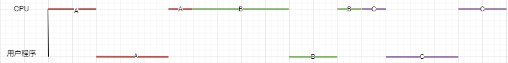
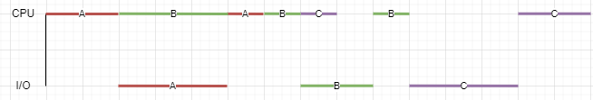
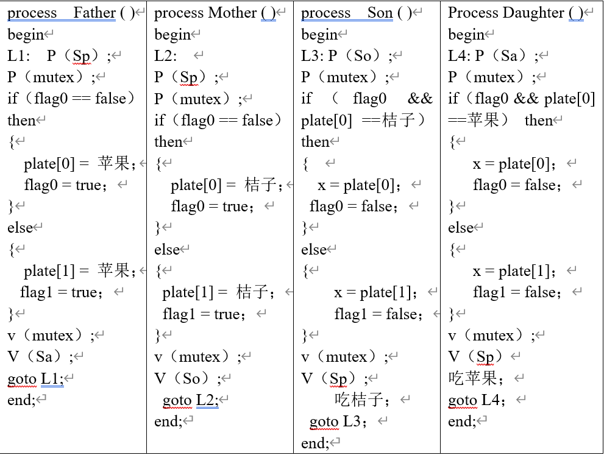
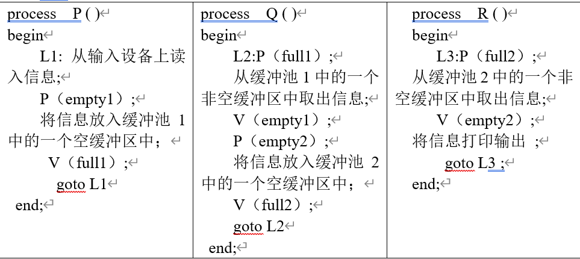
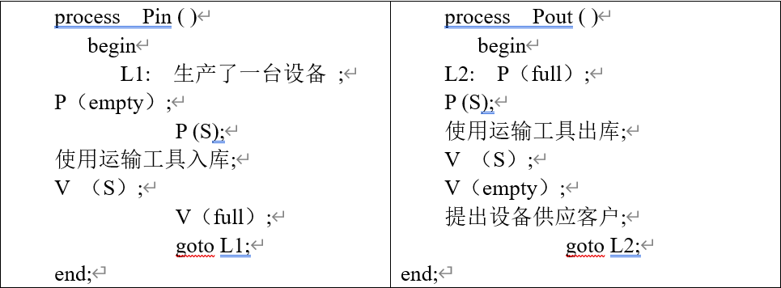
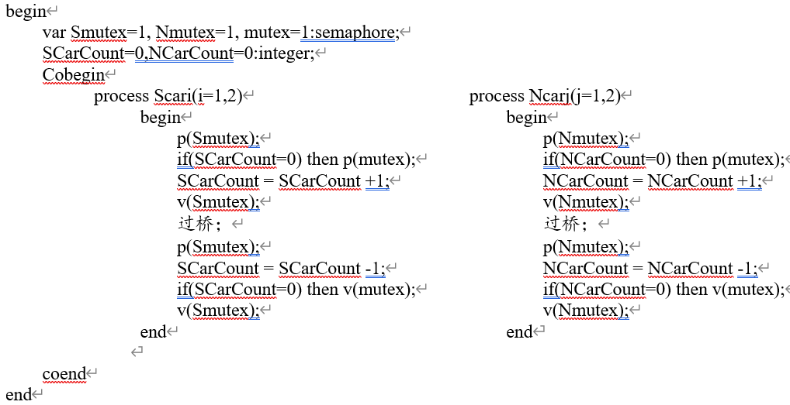
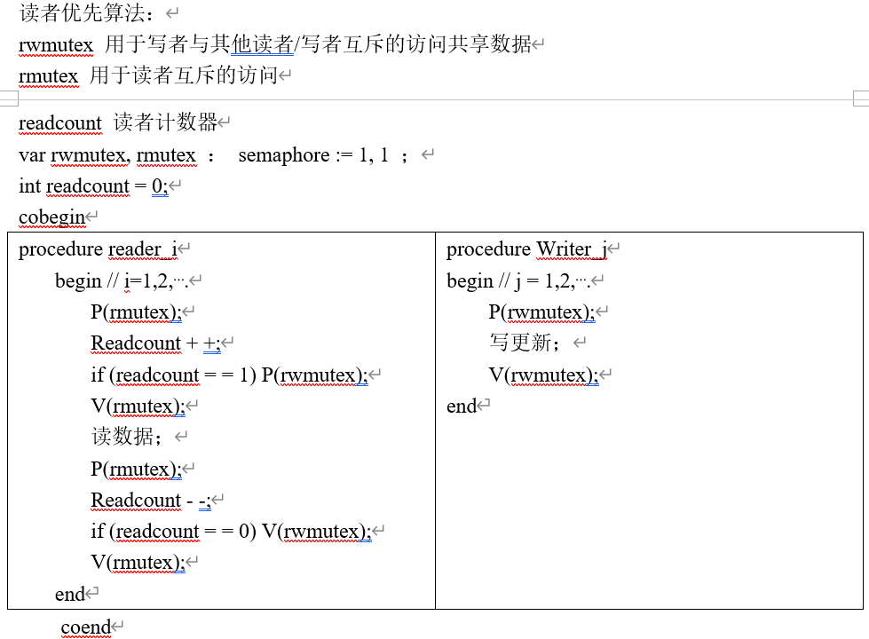
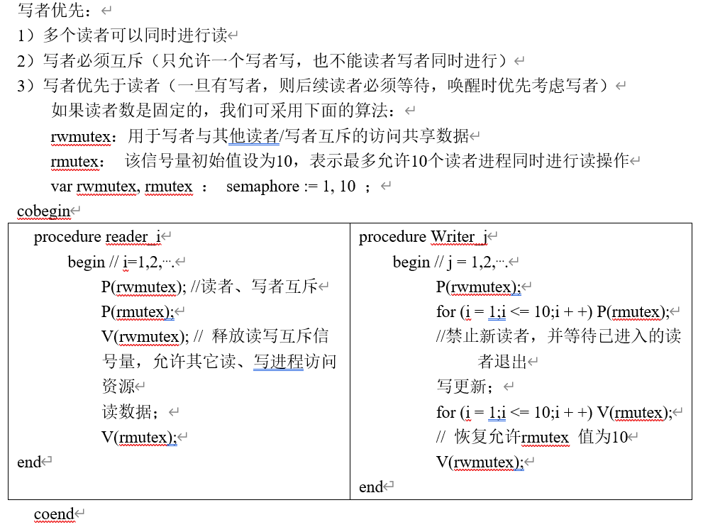
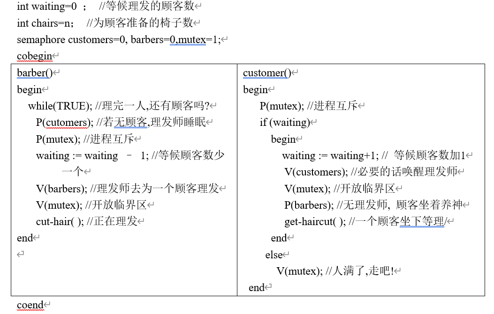
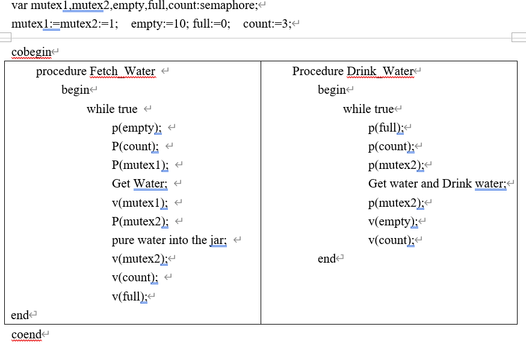

# **在“名词解释”和“简答题”部分答案错误，注意！！！！**

# 第二章

1. 有一台计算机，具有 1MB 内存，操作系统占用 200KB，每个用户占用 200KB。如果用户进程等待 I/O 的时间为 80%，若增加 1MB 内存，则 CPU 的利用率提高多少？

> CPU 利用率＝ 1-（80%）^4 = 0.59
> 若再增加 1MB 内存，系统中可同时运行 9 个用户进程，此时：
> CPU 利用率＝ 1-（80%）^9 = 0.87
> 故增加 1MB 内存使 CPU 的利用率提高了 47 % :
> 87％ / 59 ％=147 %
> 147％ - 100% = 47 %

2. 设一计算机系统有输入机一台、打印机两台，现有二道程序同时投入运行，且程序 A 先开始运行，程序 B 后运行。
   程序 A 的运行轨迹为：计算 50ms，打印信息 100ms，再计算 50ms ,打印信息 100ms ,结束。程序 B 运行的轨迹为：计算 50ms，输入数据 80ms，再计算 100ms，结束。
   要求：
   (1) 用图画出这二道程序并发执行时的工作情况。
   (2) 说明在二道程序运行时，CPU 有无空闲等待？若有，在哪段时间内等待？为什么会空闲等待？
   (3) 程序 A、B 运行时有无等待现象？在什么时候会发生等待现象？


> 2. 两道程序运行期间，CPU 存在空闲等待，时间为 100ms 至 150ms 之间
> 3. 程序 A 无等待现象，但程序 B 有等待。程序 B 有等待时间段为 180ms 至 200ms 间

3. 在单 CPU 和两台 I/O(I1 和 I2)设备的多道程序设计环境下，同时投入三个作业运行。它们的执行轨迹如下：
   Job1：I2(30ms)、CPU(10ms)、I1(30ms)、CPU(10ms)、I2(20ms)
   Job2：I1(20ms)、CPU(20ms)、I2(40ms)
   Job3：CPU(30ms)、I1(20ms) 、CPU(10ms)、I1(10ms)
   如果 CPU、I1 和 I2 都能并行工作，优先级从高到低为 Job1、Job2 和 Job3，优先级高的作业可以抢占优先级低的作业的 CPU，但是不抢占 I1 和 I2。试求：
   (1)每个作业从投入到完成分别需要多少时间。
   (2)从投入到完成 CPU 的利用率。
   (3) I/O 设备的利用率。

> 
>
> - Job1 从投入到运行完成需 110ms , Job2 从投入到运行完成需 90ms , Job3 从投入到运行完成需 110ms.
> - CPU 空闲时间段为：60ms 至 70ms , 80ms 至 90ms , 100ms 至 110ms 。所以 CPU 利用率为（110-30）/10 =72.7％。
> - 设备 I1 空闲时间段为：20ms 至 40ms , 90ms 至 100ms,故 I1 的利用率为 (110-30)/l10 = 72.7％。
>   设备 I2 空闲时间段为：30ms 至 50ms，故 I2 的利用率为(110-20)/110 =81.8％。

4. 若内存中存在 3 道程序 A、B、C，它们按照 A、B、C 的优先次序运行。各程序的计算轨迹为：
   A：计算(20ms)、I/O(30ms)、计算(10ms)
   B：计算(40ms) 、I/O(20ms)、计算(10ms)
   C：计算(10ms)、I/O(30ms)、计算(20ms)
   如果三道程序都使用相同的设备进行 I/O(即程序用串行方式使用设备，调度开销忽略不计)。试分别画出单道和多道运行的时间关系图。两种情况下，CPU 的平均利用率各为多少？

> 单道
> 
> cpu 利用率:110/190 = 57.89%
> 多道
> 
> cpu 利用率:110/140 = 78.6%

5. 有一阅览室，共有 100 个座位。读者进入时必须先在一张登记表上登记，该表为每一座位列一表目，包括座号和读者姓名。读者离开时要消掉登记内容。试用 P、V 操作描述读者进程的同步结构

```powershell
begin
   Sin, Sout, seat：semaphore;
   seat :=100;
	  Sin := 1;
	  Sout := 1;
cobegin
process Reader-i ( i = 1,2,…,n );
	begin
		P(seat);
		P(Sin);
		登记;
		V(Sin);
		进入阅览室;
		读书;
		离开阅览室;
		P(Sout);
		注销;
		V(Sout);
		V（seat）;
	end
coend;
end;

```

6. 设公共汽车上，司机的活动顺序是：启动车辆、正常行车、到站停车；售票员的活动顺序是：关车门、售票、开车门。现假设初始状态为：司机和售票员都已经在车上，汽车处于停止状态，车门处于开的状态。在汽车不断地到站、停车、行驶过程中，请用信号量的 PV 操作实现司机与售票员之间的同步关系。

> 示意图
> 
> 题解

```powershell
begin
close, stop：semaphore;
  	close := 0;
  	stop := 0;
cobegin
Driver ( );
Busman ( );
coend;
end;

process  Driver ( )
begin
 L1: P（close）；
启动车辆；
 正常行始；
到站停车；
V（stop）；
 goto L1
end;

process  Busman ( )
begin
   L2: 关车门；
   V（close）;
   售票；
   P（stop）;
   开车门；
goto L2
end;
```

7. 设有三个进程 A、B、C，其中 A 与 B 构成一对生产者与消费者（A 为生产者，B 为消费者），共享一个由 n 个缓冲块组成的缓冲池；B 与 C 也构成一对生产者与消费者（此时 B 为生产者，C 为消费者），共享另一个由 m 个缓冲块组成的缓冲池。用 P、V 操作描述它们之间的同步关系.

```powershell
mutexA,emptyA,fullA,mutexC,emptyC,fullC	: semaphere;
i,j,a,b	: integer;
bufferA : array 0..n-1 of item
bufferC : array 0..m-1 of item;

procedure produceA：
生产者进程A
   begin
   while ture do
   begin
   Produce next product;
   P(emptyA);
   P(mutexA);
   bufferA(i) :=products;
   i:=(i+1) mod(n) ;
   V(mutexA);
   V(fullA)
   end
end

procedure consumer_procedurerB:
  消费者和生产者进程B
   begin
   while ture do
   begin
   P(fullA);
   P(mutexA);
   Goods:=buffer(j);
   j:=(j+1)mod(n);
   V(mutexA);
   V(emptyA);
   Consume goods and Produce next product C;
   P(emptyC);
   P(mutexC);
   BufferC(a):=product C;
   a:=(a+1) mod(m);
   V(mutexC);
   V(fullC)
   end
end;

procedure consumerC ;
消费者C进程
   begin
   while  ture  do
   begin
   P(fullC);
   P(mutexC);
   Goods:=bufferC(b);
   b:=(b+1) mod(m);
   V(mutexC);
   V(emptyC);
   Consume product;
   end
end;

begin
   Seminitsal(mutexA.v,1;mutexC.v,1; emptyA.v,n;emptyC.v,m;fullA.V,0;fullC.V,0);
   i:=0;j:=0;a:=0;b:=0;
   cobegin

   produce A
   consumer_procedurerB;
   consumerC
   coend
end.
```

8. 桌上有一个空盘子，最多容纳两个水果，每次仅能放入或取出一个水果。爸爸向盘中放苹果，妈妈向盘中放桔子，规定两个儿子专等吃盘中的桔子，两个女儿专等吃盘中的苹果。请用信号量实现爸爸、妈妈、儿子、女儿之间的同步
   

> 信号量:
> 盘中无水果，Sp，初值 2；
> 盘中有桔子，So，初值 0；
> 盘中有苹果，Sa，初值 0；
> flag0 = flag1 = false；
> mutex = 1；
> plate ARRAY[0，1] of （apple，orange）

```powershell
begin
   Sp,So,Sa：semaphore;
   Sp :=1;
   So :=0;
   Sa :=0;
cobegin
Father ( );
Mother ( );
Son ( );
Daughter ( );
coend;
end;
```

 9. 假设有三个并发进程 P，Q，R，其中 P 负责从输入设备上读入信息并传送给 Q，Q 将信息加工后传送给 R，R 则负责将信息打印输出。写出下列条件的并发程序：
（1）进程 P、Q 共享一个缓冲区，进程 Q、R 共享另一个缓冲区。
（2）进程 P、Q 共享一个由 m 个缓冲区组成的缓冲池，进程 Q、R 共享另一个由 n 个缓冲区组成的缓冲池。

- 1
  

  > 信号量
  > 缓存区 1 无数据，empty1，初值 1
  > 缓存区 1 有数据，full1，初值 0
  > 缓存区 2 无数据，empty2，初值 1
  > 缓存区 2 有数据，full2，初值 0

  ```powershell
  begin
  empty1,empty2,full1,full2：semaphore;
  empty1 :=1;
    	empty2 :=1;
   		full1 :=0;
    	full2 :=0;
  cobegin
  P ( );
  Q ( );
  R ( );
  coend;
  end;
  ```

  

- 2
  

  > 信号量
  > 缓冲池 1 中的空缓冲区的数量，empty1，初值 m
  > 缓冲池 1 中的非空缓冲区的数量，full1，初值 0
  > 缓冲池 2 中的空缓冲区的数量，empty2，初值 n
  > 缓冲池 2 中的非空缓冲区的数量，full2，初值 0

  ```powershell
  begin
  empty1,empty2,full1,full2：semaphore;
  empty1 :=m;
    	empty2 :=n;
   		full1 :=0;
    	full2 :=0;
  cobegin
  P ( );
  Q ( );
  R ( );
  coend;
  end;
  ```

  

10. 某工厂有一个可以存放设备的仓库，总共可以存放 10 台设备。生产的每一台设备都必须入库，销售部门可从仓库提出设备供应客户。设备的入库和出库都必须借助运输工具。现只有一台运输工具，每次只能运输一台设备。请设计一个能协调工作的自动调度管理系统
    

> 信号量

```powershell
begin
   empty, full, S：semaphore;
   empty := 10;
full := 0;
S := 1;
cobegin
	Pin ();
	Pout ();
coend;
end;
```

 11. 有一个桥如图所示，桥上的车流如箭头所示。桥上不允许两车交会，但允许同方向多辆车依次通行(即桥上可以有多个同方向的车)。请用 P、V 操作实现交通管理以防止桥上拥塞的程序。

> (1)桥每次只能有一辆车通过
> 
> (2)不允许两车交会,但允许同方向的多辆车依次通过
> 

12. 哲学家进餐问题(The Dining Philosophers Problem)
    5 个哲学家围绕一张圆桌而坐，桌子上放着 5 支筷子，每两个哲学家之间放一支；哲学家的动作包括思考和进餐，进餐时需要同时拿起他左边和右边的两支筷子，思考时则同时将两支筷子放回原处。如何保证哲学家们的动作有序进行？如：不出现相邻者同时要求进餐；不出现有人永远拿不到筷子；
13. 读者--写者问题(Readers-Writers Problem)
    有一个许多进程共享的数据区，这个数据区可以是一个文件或者主存的一块空间；有一些只读取这个数据区的进程（Reader）和一些只往数据区写数据的进程(Writer)，此外还需要满足以下条件：
    （1）任意多个读进程可以同时读这个文件；
    （2）一次只有一个写进程可以往文件中写；
    （3）如果一个写进程正在进行操作，禁止任何读进程度文件。
    实验要求用信号量来实现读者写者问题的调度算法。实验提供了 Semaphore 类，该类通过 P()、V()两个方法实现了 P、V 原语的功能。实验的任务是修改 Reader 类的 Read 方法以及 Writer 类的 Write 方法。

> (1)读者优先



> (2)写者优先

 14. 理发师问题(Barber Problem)
理发店理有一位理发师、一把理发椅和 n 把供等候理发的顾客坐的椅子如果没有顾客，理发师便在理发椅上睡觉一个顾客到来时，它必须叫醒理发师如果理发师正在理发时又有顾客来到，则如果有空椅子可坐，就坐下来等待，否则就离开。

> **信号量** 1)控制变量 waiting 用来记录等候理发的顾客数，初值均为 0； 2)信号量 customers 用来记录等候理发的顾客数，并用作阻塞理发师进程，初值为 0； 3)信号量 barbers 用来记录正在等候顾客的理发师数，并用作阻塞顾客进程，初值为 0； 4)信号量 mutex 用于互斥，初值为 1

 15. 少林寺问题
某寺庙，有小和尚、老和尚若干．庙内有一水缸，由小和尚提水入缸，供老和尚饮用。水缸可容纳 10 桶水，每次入水、取水仅为 1 桶，不可同时进行。水取自同一井中，水井径窄，每次只能容纳一个水桶取水。设水桶个数为 3 个，试用信号灯和 PV 操作给出老和尚和小和尚的活动。

> **思路**
> 设水井和水缸为临界资源，引入 mutex1,mutex2；三个水桶无论从井中取水还是放入水缸中都一次一个，应该给他们一个信号量 count，抢不到水桶的进程只好为等待，水缸满了时，不可以再放水了。设 empty 控制入水量，水缸空了时，不可取水设 full



# 第三章

1. What common events lead to the creation of a process?

> **哪些常见的事件会导致进程的创建** > _New batch job; interactive logon; created by OS to provide a service; spawned by existing process. See Table 3.1 for details._
> 新的批处理作业 `<br/>`交互式登录 `<br/>`由操作系统创建以提供服务 `<br/>`由现有进程派生

2. For the five-state processing model, briefly define each state.

> **对于五状态处理模型，请简要定义每个状态：**
> New (新建)：进程刚被创建，但尚未被操作系统调度执行。
> Ready (就绪)：进程已经准备好执行，但还未开始执行。它等待操作系统为其分配处理器资源。
> Running (运行)：进程正在执行中，它占用了处理器资源并正在执行指令。
> Blocked (阻塞)：进程无法继续执行，因为它正在等待某种外部事件的发生，例如等待输入/输出完成或等待资源的可用性。
> Terminated (终止)：进程已经完成执行，或者被操作系统终止。在这个状态下，进程占用的系统资源已经被释放，它不再占用处理器或内存资源。

3. What does it mean to preempt a process?

> **抢占进程意味着什么** > _Process preemption occurs when an executing process is interrupted by the processor so that another process can be executed._
> 当一个正在执行的进程被处理器中断以便可以执行另一个进程时，就会发生进程抢占。

4. What are the steps performed by an OS to create a new process?

> **执行哪些步骤来创建新进程？** > _①Assign a unique process identifier to the new process. ②Allocate space for the process.③Initialize the process control block.④Set the appropriate linkages.⑤Create or expand other data structures._
> ① 为新流程分配唯一的流程标识符 `<br/>`② 为流程分配空间 `<br/>`③ 初始化过程控制块 `<br/>`④ 设置适当的链接 `<br/>`⑤ 创建或扩展其他数据结构。

5. List reasons why a mode switch between threads may be cheaper than a mode switch between processes.

> **在线程之间进行模式切换比进程之间进行模式切换更廉价的原因**
> 线程转换包含的状态信息更少

6. In the discussion of ULTs versus KLTs, it was pointed out that a disadvantage of ULTs is that when a ULT executes a system call, not only is that thread blocked, but also all of the threads within the process are blocked. Why is that so?

> **在讨论超低温灭菌与 KLT 时，有人指出，超低温反应的一个缺点是，当超低温终端执行系统调用时，不仅该线程被阻塞，而且进程内的所有线程都被阻塞。为什么会这样？**
> 对于 ULT，进程的线程结构对操作系统不可见，操作系统仅根据进程进行调度。

7. Consider a computer with N processors in a multiprocessor configuration.
   - a. How many processes can be in each of the Ready, Running, and Blocked states at one time?
   - b. What is the minimum number of processes that can be in each of the Ready, Running, and Blocked states at one time?

> **考虑一个具有 N 个处理器的多处理器配置的计算机。`<br/>`a. 在任意时刻，每个状态（就绪状态、运行状态和阻塞状态）中可以有多少个进程？在多处理器配置中，每个处理器都可以同时执行一个进程。因此，在就绪状态、运行状态和阻塞状态中，每个处理器都可以有一个进程。因此，每个状态中的进程数量将等于处理器的数量 N。`<br/>`b.在任意时刻，每个状态中最少可以有多少个进程？最少数量的情况是每个处理器都有一个进程。因此，在就绪状态、运行状态和阻塞状态中，每个状态中的进程数量将等于处理器的数量 N。**

8. The queue model suggests that a process can only be in one Event queue at a time.
   - a. Is it possible that you would want to allow a process to wait on more than one event at the same time? Provide an example.
   - b. In that case, how would you modify the queuing structure of the figure to support this new feature?

> **队列模型表明一个进程一次只能在一个事件队列中等待。`<br/>`a. 是否可能希望允许一个进程同时等待多个事件？请举例说明。`<br/>`b. 在这种情况下，如何修改图中的队列结构以支持这一新功能？**
> a.
> b.

9. A multiprocessor with eight processors has 20 attached tape drives. There is a large number of jobs submitted to the system that each require a maximum of four tape drives to complete execution. Assume that each job starts running with only three tape drives for a long period before requiring the fourth tape drive for a short period toward the end of its operation. Also assume an endless supply of such jobs.

- a. Assume the scheduler in the OS will not start a job unless there are four tape drives available. When a job is started, four drives are assigned immediately and are not released until the job finishes. What is the maximum number of jobs that can be in progress at once? What are the maximum and minimum number of tape drives that may be left idle as a result of this policy?
- b. Suggest an alternative policy to improve tape drive utilization and at the same time avoid system deadlock. What is the maximum number of jobs that can be in progress at once? What are the bounds on the number of idling tape drives?

> **具有 8 个处理器的多处理器有 20 个连接的磁带机。有大量作业提交到系统，每个作业最多需要四个磁带机才能完成执行。假设每个作业在很长一段时间内仅使用三个磁带驱动器开始运行，然后在操作结束时需要第四个磁带驱动器在短时间内运行。还要假设此类工作无穷无尽。`<br/>`a.假设操作系统中的调度程序不会启动作业，除非有四个磁带驱动器可用。启动作业时，会立即分配四个驱动器，并且在作业完成之前不会释放。一次可以进行的最大作业数是多少？由于此策略，可能处于空闲状态的磁带驱动器的最大和最小数量是多少？ `<br/>`b.建议一个替代策略，以提高磁带机利用率，同时避免系统死锁。一次可以进行的最大作业数是多少？空闲磁带机的数量限制是什么？**
> a.如果使用保守策略，则最多 20/4 = 5 个进程可以同时处于活动状态。由于分配给每个进程的一个驱动器大部分时间可能处于空闲状态，因此一次最多有 5 个驱动器处于空闲状态。在最好的情况下，所有驱动器都不会空闲
> b.为了提高驱动器利用率，每个进程最初可以分配三个磁带驱动器。第四个将按需分配。在此策略中，最多 20/3=6 个进程可以同时处于活动状态。空闲驱动器的最小数量为 0，最大数量为 2

# 第六章

1. Consider the following snapshot of a system. There are no outstanding unsatisfied requests for resources.
   available

| r1  | r2  | r3  | r4  |
| :-- | :-- | :-- | :-- |
| 2   | 1   | 0   | 0   |

|     | current allocation | maximum demand | still needs |
| :-: | :----------------: | :------------: | :---------: |
|     |    r1 r2 r3 r4     |  r1 r2 r3 r4   | r1 r2 r3 r4 |
| p1  |      0 0 1 2       |    0 0 1 2     |             |
| p2  |      2 0 0 0       |    2 7 5 0     |             |
| p3  |      0 0 3 4       |    6 6 5 6     |             |
| p4  |      2 3 5 4       |    4 3 5 6     |             |
| p5  |      0 3 3 2       |    0 6 5 2     |             |

- a. Compute what each process still might request and display in the columns labeled “still needs.”
- b. Is this system currently in a safe or unsafe state? Why?
- c. Is this system currently deadlocked? Why or why not?
- d. Which processes, if any, are or may become deadlocked?
- e. If a request from p3 arrives for (0, 1, 0, 0), can that request be safely granted immediately? In what state (deadlocked, safe, unsafe) would immediately granting that whole request leave the system? Which processes, if any, are or may become deadlocked if this whole request is granted immediately?

> **a. 计算每个进程仍可能请求的内容，并显示在标有“still needs”的列中。
> b. 这个系统当前处于安全状态还是不安全状态？为什么？
> c. 这个系统当前是否处于死锁状态？为什么或为什么不是？
> d. 如果有进程发生死锁，它们中的哪些进程是或可能会出现死锁？
> e. 如果进程 p3 发送一个对(0, 1, 0, 0)的请求，这个请求能够立即安全地被授予吗？如果立即授予整个请求，系统会处于什么状态（死锁、安全、不安全）？如果立即授予整个请求，这些进程中的哪些是或可能会出现死锁？** > \*\*

2. Consider a system with a total of 150 units of memory, allocated to three processes as shown:

| Process | Max | Hold |
| :-----: | :-: | :--: |
|    1    | 70  |  45  |
|    2    | 60  |  40  |
|    3    | 60  |  15  |

Apply the banker’s algorithm to determine whether it would be safe to grant each of the following requests. If yes, indicate a sequence of terminations that could be guaranteed possible. If no, show the reduction of the resulting allocation table.

- a. A fourth process arrives, with a maximum memory need of 60 and an initial need of 25 units.
- b. A fourth process arrives, with a maximum memory need of 60 and an initial need of 35 units.

> **应用银行家算法来确定是否安全地授予以下请求。如果可以，指示可能保证的终止顺序。如果不行，展示导致分配表减少的情况。
> a. 一个第四个进程到达，最大内存需求为 60，初始需求为 25 个单位。
> b. 一个第四个进程到达，最大内存需求为 60，初始需求为 35 个单位。
> 请提供当前系统的分配表和可用资源表以便进行计算。**

3. - a. Three processes share four resource units that can be reserved and released only one at a time. Each process needs a maximum of two units. Show that a deadlock cannot occur.
   - b. N processes share M resource units that can be reserved and released only one at a time. The maximum need of each process does not exceed M, and the sum of all maximum needs is less than M + N. Show that a deadlock cannot occur.

> **a. 三个进程共享四个资源单位，每次只能预留和释放一个单位。每个进程最多需要两个单位。证明死锁不会发生 `<br/>`b. N 个进程共享 M 个资源单位，每次只能预留和释放一个单位。每个进程的最大需求不超过 M，并且所有最大需求的总和小于 M + N。证明死锁不会发生**

4. The two variables a and b have initial values of 1 and 2, respectively. The following code is for a Linux system:

| Thread 1 | Thread 2 |
| :------: | :------: |
|   a=3;   |    —     |
|  mb();   |    —     |
|   b=4;   |   c=b;   |
|    —     |  rmb();  |
|    —     |   d=a;   |

What possible errors are avoided by the use of the memory barriers?

> **变量 a 和 b 的初始值分别为 1 和 2。以下代码适用于 Linux 系统：
> 使用内存屏障可以避免哪些可能的错误？**

# 第七章

1. Another placement algorithm for dynamic partitioning is referred to as worst-fit. In this case, the largest free block of memory is used for bringing in a process. Discuss the pros and cons of this method compared to first-, next-, and best-fit. What is the average length of the search for worst-fit?

> **最差适应（worst-fit）算法是一种用于动态分区的另一种放置算法。在这种情况下，最大的空闲内存块用于装入一个进程。与首次适应（first-fit）、循环首次适应（next-fit）和最佳适应（best-fit）相比，讨论一下最差适应方法的优缺点。最差适应方法的平均搜索长度是多少？**

2. A dynamic partitioning scheme is being used, and the following is the memory configuration at a given point in time:

<table>
<tr>
<td bgcolor=＃00FFFF>20M</td>
<td>20M</td>
<td bgcolor=＃00FFFF>40M</td>
<td>60M</td>
<td bgcolor=＃00FFFF>20M</td>
<td>10M</td>
<td bgcolor=＃00FFFF>60M</td>
<td>40M</td>
<td bgcolor=＃00FFFF>20M</td>
<td>30M</td>
<td bgcolor=＃00FFFF>40M</td>
<td>40M</td>
</tr>
</table>
The shaded areas are allocated blocks; the white areas are free blocks. The next three memory requests are for 40M, 20M, and 10M. Indicate the starting address for each of the three blocks using the following placement algorithms:

- a. First-fit
- b. Best-fit
- c. Next-fit. Assume the most recently added block is at the beginning of memory.
- d. Worst-fit

> **阴影区域是分配的块；白色区域是空闲块。接下来的三个内存请求分别是 40M、20M 和 10M。使用以下放置算法指示三个块中每个块的起始地址：
> -a.首次适应
> -b.最佳适应
> -c.循环首次适应,假设最近添加的块位于内存的开头。
> -d.最差适应**
> 的

3. A 1-Mbyte block of memory is allocated using the buddy system.
   - a. Show the results of the following sequence in a figure similar to Figure 7.6: Request 70; Request 35; Request 80; Return A; Request 60; Return B; Return D; Return C.
   - b. Show the binary tree representation following Return B.

> **使用伙伴系统分配了 1 兆字节的内存块。
> a. 请用类似于图 7.6 的图表展示以下顺序的结果：请求 70；请求 35；请求 80；返回 A；请求 60；返回 B；返回 D；返回 C。
> b. 展示 Return B 后的二叉树表示形式。**

4. Consider a simple paging system with the following parameters: 232 bytes of physical memory; page size of 210 bytes; 216 pages of logical address space.
   - a. How many bits are in a logical address?
   - b. How many bytes in a frame?
   - c. How many bits in the physical address specify the frame?
   - d. How many entries in the page table?
   - e. How many bits in each page table entry?

> **考虑一个具有以下参数的简单分页系统：232 字节的物理内存；页面大小为 210 字节；逻辑地址空间的 216 个页面。
> a. 逻辑地址中有多少位？
> b. 每帧有多少个字节？
> c. 物理地址中有多少位指定帧？
> d. 页面表中有多少个条目？
> e. 每个页面表条目有多少位？**

5. Consider a simple segmentation system that has the following segment table:

| Starting Address | Length(bytes) |
| :--------------: | :-----------: |
|       660        |      248      |
|       1752       |      422      |
|       222        |      198      |
|       996        |      604      |

For each of the following logical addresses, determine the physical address or indicateif a segment fault occurs:

- a. 0, 198
- b. 2, 156
- c. 1, 530
- d. 3, 444
- e. 0, 222

> **对于以下每个逻辑地址，确定物理地址或指示是否发生段错误：
> a. 0，198
> b. 2，156
> c. 1，530
> d. 3，444
> e. 0，222**

# 第八章

1. Suppose the page table for the process currently executing on the processor looks like the following. All numbers are decimal, everything is numbered starting from zero, and all addresses are memory byte addresses. The page size is 1024 bytes.

| Virtual page number | Valid bit | Reference bit | Modily bit | Page framenumber |
| :-----------------: | :-------: | :-----------: | :--------: | :--------------: |
|          0          |     1     |       1       |     0      |        4         |
|          1          |     1     |       1       |     1      |        7         |
|          2          |     0     |       0       |     0      |        -         |
|          3          |     1     |       0       |     0      |        2         |
|          4          |     0     |       0       |     0      |        -         |
|          5          |     1     |       0       |     1      |        0         |

- a. Describe exactly how, in general, a virtual address generated by the CPU is translated into a physical main memory address.
- b. What physical address, if any, would each of the following virtual addresses correspond to? (Do not try to handle any page faults, if any.)
  - (i) 1052
  - (ii) 2221
  - (iii) 5499

> **假设当前正在处理器上执行的进程的页表如下所示。所有数字都是十进制数，从零开始编号，所有地址都是内存字节地址。页面大小为 1024 字节。
> a. 具体来说，描述 CPU 生成的虚拟地址如何转换为物理主存储器地址。
> b. 如果有的话，下面每个虚拟地址对应的物理地址是什么？（不需要处理任何页面错误。）
> (i) 1052
> (ii) 2221
> (iii) 5499**

2. Consider a paged virtual memory system with 32-bit virtual addresses and 1K-byte pages. Each page table entry requires 32 bits. It is desired to limit the page table size to one page.

   - a. How many levels of page tables are required?
   - b. What is the size of the page table at each level? Hint: One page table size is smaller.
   - c. The smaller page size could be used at the top level or the bottom level of the page table hierarchy. Which strategy consumes the least number of pages?

3. A process has four page frames allocated to it. (All the following numbers are decimal, and everything is numbered starting from zero). The time of the last loading of a page into each page frame, the time of last access to the page in each page frame, the virtual page number in each page frame, and the referenced (R) and modified (M) bits for each page frame are as shown (the times are in clock ticks from the process start at time 0 to the event — not the number of ticks since the event to the present).

| Virtual page number | Page frame | Time loaded | Time referenced | R bit | M bit |
| :-----------------: | :--------: | :---------: | :-------------: | :---: | :---: |
|          2          |     0      |     60      |       161       |   0   |   1   |
|          1          |     1      |     130     |       160       |   1   |   0   |
|          0          |     2      |     26      |       162       |   1   |   0   |
|          3          |     3      |     20      |       163       |   1   |   1   |

A page fault to virtual page 4 has occurred at time 164.Which page frame will have its contents replaced for each of the following memory management policies? Explain why in each case.

- a. FIFO (first-in-first-out)
- b. LRU (least recently used)
- c. Clock
- d. Optimal (Use the following reference string.)
- e. Given the aforementioned state of memory just before the page fault, consider the following virtual page reference string:
  <>4, 0, 0, 0, 2, 4, 2, 1, 0, 3, 2
  How many page faults would occur if the working set policy with LRU were used with a window size of 4 instead of a fixed allocation? Show clearly when each page fault would occur.

4. four page frames in main memory. The following page trace occurs:
   1, 0, 2, 2, 1, 7, 6, 7, 0, 1, 2, 0, 3, 0, 4, 5, 1, 5, 2, 4, 5, 6, 7, 6, 7, 2, 4, 2, 7, 3, 3, 2, 3

   - a. Show the successive pages residing in the four frames using the LRU replacement policy. Compute the hit ratio in main memory.Assume that the frames are initially empty.
   - b. Repeat part (a) for the FIFO replacement policy.
   - c. Compare the two hit ratios and comment on the effectiveness of using FIFO to approximate LRU with respect to this particular trace.

5. Assuming a page size of 4 Kbytes and that a page table entry takes 4 bytes, how many levels of page tables would be required to map a 64-bit address space, if the top level page table fits into a single page?
6. Assume that a task is divided into four equal-sized segments and that the system builds an eight-entry page descriptor table for each segment. Thus, the system has a combination of segmentation and paging. Assume also that the page size is 2 Kbytes.

   - a. What is the maximum size of each segment?
   - b. What is the maximum logical address space for the task?
   - c. Assume that an element in physical location 00021ABC is accessed by this task.
     What is the format of the logical address that the task generates for it? What is the maximum physical address space for the system?

7. Consider a paged logical address space (composed of 32 pages of 2 Kbytes each) mapped into a 1-Mbyte physical memory space.

   - a. What is the format of the processor’s logical address?
   - b. What is the length and width of the page table (disregarding the “access rights”bits)?
   - c. What is the effect on the page table if the physical memory space is reduced by half?

# 第九章

1. Consider the following set of processes:

| Process Name | Arrival Time | Processing Time |
| :----------: | :----------: | :-------------: |
|      A       |      0       |        1        |
|      B       |      1       |        9        |
|      C       |      2       |        1        |
|      D       |      3       |        9        |

Perform the same analysis as depicted in Table 9.5 and Figure 9.5 for this set.

2. Consider the following pair of equations as an alternative to Equation (9.3):
   $Sn+1 =αTn + (1 - α)Sn$
   $Xn+1 = min[Ubound, max[Lbound, (βSn+1)]]$
   where Ubound and Lbound are prechosen upper and lower bounds on the estimated value of T. The value of Xn+1 is used in the shortest-process-next algorithm, instead of the value of Sn+1.What functions do α and β perform, and what is the effect of higher and lower values on each?
3. Define residence time $Tr$ as the average total time a process spends waiting and being served. Show that for FIFO, with mean service time $Ts$, we have $Tr = Ts/(1 – ρ)$, where $ρ$ is utilization.
4. 若后备作业队列中等待运行的同时有 N 个作业$J1、J2, …, Jn$，已知它们各自的运行为$t1,t2,…, tn$，且满足$t1<t2<…<tn$。试证明采用短作业优先算法调度能获得最小平均周转时间。
5. 假定执行表中作业队列，作业号为到达顺序，依次在时刻 0 按次序 1、2、3、4、5 进入单处理器系统。(1) 分别用先来先服务调度算法、时间片轮转调度算法、短作业优先调度算法以及非抢占优先权调度算法算出各作业的执行先后次序(注意优先权高的数值小)；(2) 计算各种情况下作业的平均作业周转时间和平均作业带权周转时间。

| 作业号 | 执行时间 | 优先权 |
| :----: | :------: | :----: |
|   1    |    10    |   3    |
|   2    |    1     |   1    |
|   3    |    2     |   3    |
|   4    |    1     |   4    |
|   5    |    5     |   2    |

6. 有 5 个批处理作业 A 到 E 均已到达计算中心，其运行时间分别为：2、4、6、8 和 10 分钟；各自的优先级分别被规定为 1、2、3、4 和 5，这里 5 为最高级。

| 作业 | 优先级 | 运行时间 |
| :--: | :----: | :------: |
|  A   |   1    |    2     |
|  B   |   2    |    4     |
|  C   |   3    |    6     |
|  D   |   4    |    8     |
|  E   |   5    |    10    |

对于 1)**时间片轮转算法**,每个作业获得相同的 2 分钟的时间片 2)**优先数算法**,采用单道运行 3)**短作业优先算法**,采用单道运行 4)**先来先服务调度算法**,采用单道运行(按到达次序 C、D、B、E、A)
在忽略进程切换时间的前提下，计算出平均作业周转时间

7. 单道批处理系统中，下列三个作业采用先来先服务调度算法和最高响应比算法进行调度，哪一种算法性能较好？请完成下表：

| 作业 | 提交时间 | 运行时间 | 开始时间 | 完成时间 | 周转时间 | 带权周转时间 |
| :--: | :------: | :------: | :------: | :------: | :------: | :----------: |
|  1   |  10:00   |   2:00   |          |          |          |              |
|  2   |  10:10   |   1:00   |          |          |          |              |
|  3   |  10:25   |   0:25   |          |          |          |              |

**平均作业周转时间 T=\*\***平均作业带权周转时间 W=\*\*

8. 若有一个四道作业系统，如果在一段时间内先后有 6 个作业，它们提交和运行时间由下表给出(时间单位为分钟)。系统采用短作业优先(SJF)调度算法，作业被调度进入系统后中途不会退出，但是作业会被更短的作业抢占。问题：
   - (1) 画图给出 6 个作业的执行时间序列；
   - (2) 完成各个作业的开始时间、完成时间、周转时间和带权周转时间。
   - (3) 计算平均作业周转时间和平均作业带权周转时间

| 作业 | 提交时间 | 运行时间 | 开始时间 | 完成时间 | 周转时间 | 带权周转时间 |
| :--: | :------: | :------: | :------: | :------: | :------: | :----------: |
|  1   |   8:00   |    60    |          |          |          |              |
|  2   |   8:10   |    35    |          |          |          |              |
|  3   |   8:25   |    20    |          |          |          |              |
|  4   |   8:25   |    25    |          |          |          |              |
|  5   |   8:25   |    5     |          |          |          |              |
|  6   |   8:25   |    10    |          |          |          |              |

9. 有一个具有两道作业的批处理系统，作业调度采用短作业优先的调度算法，进程调度采用以优先数为基础的抢占式调度算法，在下表所示的作业序列，作业优先数即为进程优先数，优先数越小优先级越高。

| 作业 | 提交时间 | 运行时间 | 优先数 |
| :--: | :------: | :------: | :----: |
|  A   |  10:00   |    40    |   5    |
|  B   |  10:20   |    30    |   3    |
|  C   |  10:30   |    50    |   4    |
|  D   |  10:50   |    20    |   6    |

- (1) 列出所有作业进入内村时间及结束时间。
- (2) 计算平均周转时间。

10. 一个实时系统有 4 个周期性事件，周期分别为$50、100、300和250ms$，若假设其处理分别需要$35、20、10 和δms$，则该系统可调度允许的$δ最大值为多少ms$

# 第十章

# 第十一章

1. Assume a disk with 200 tracks and that the disk request queue has random requests in it. The requested tracks, in the order received by the disk scheduler, are 27, 129, 110, 186, 147, 41, 10, 64, 120. Assume that the disk head is initially positioned over track 100 and is moving in the direction of decreasing track number. Using disk scheduling algorithms FIFO, SSFT, SCAN to calculate the number of tracks traversed.

> **假设一个带有 200 个轨道的磁盘，并且磁盘请求队列中有随机的请求。 磁盘调度程序收到的订单中所请求的轨道为 27、129、110、186、147、41、41、10、64、120。假设磁盘头最初位于轨道 100 上，并且正在向方向移动 减小轨道编号。 使用磁盘调度算法 FIFO，SSFT，扫描来计算遍历的轨道数量。** > \*\*

2. Assume that the disk rotates at 360 rpm. A processor reads one sector from the disk using interrupt-driven I/O, with one interrupt per byte. If it takes 2.5 µs to process each interrupt, what percentage of the time will the processor spend handling I/O (disregard seek time)?
3. A 32-bit computer has two selector channels and one multiplexor channel. Each selector channel supports two magnetic disk and two magnetic tape units. The multiplexor channel has two line printers, two card readers, and ten VDT terminals connected to it. Assume the following transfer rates:
   Disk drive 800 Kbytes/s
   Magnetic tape drive 200 Kbytes/s
   Line printer 6.6 Kbytes/s
   Card reader 1.2 Kbytes/s
   VDT 1 Kbytes/s
   Estimate the maximum aggregate I/O transfer rate in this system.
4. 假设有 8 个记录 A、B，C、D、E、F、G、H 存放在磁盘里，每个磁道有 8 个扇区，正好可以存放 8 个记录。假设磁盘旋转速度为 20ms/转，处理程序每读出一个记录后，用 2ms 的时间进行处理，请问：

   - a．当记录 A、B、C、D、E、F、G、H 按顺序放在磁道上时，顺序处理这 8 个记录花费的总时间是多少？假设启动时的位置正好在 A 扇区的起点。
   - b．如何采取优化方法，使处理这些记录所花费的总时间最短？并求出该最短时间。

5. Calculate how much disk space (in sectors, tracks, and surfaces) will be required to store 300,000 120-byte logical records if the disk is fixed-sector with 512 bytes/sector, with 96 sectors/track, 110 tracks per surface, and 8 usable surfaces. Ignore any file header record(s) and track indexes, and assume that records cannot span two sectors.

# 第十二章

1. Define:
   B= block size
   R= record size
   P= size of block pointer
   F= blocking factor; expected number of records within a block
   Give a formula for F for the three blocking methods depicted in Figure 12.6.
2. One scheme to avoid the problem of preallocation versus waste or lack of contiguity is to allocate portions of increasing size as the file grows. For example, begin with a portion size of one block, and double the portion size for each allocation. Consider a file of n records with a blocking factor of F, and suppose that a simple one-level index is used as a file allocation table.

   - a. Give an upper limit on the number of entries in the file allocation table as a function of F and n.
   - b. What is the maximum amount of the allocated file space that is unused at any time?

3. Ignoring overhead for directories and file descriptors, consider a file system in which files are stored in blocks of 16K bytes. For each of the following file sizes, calculate the percentage of wasted file space due to incomplete filling of the last block: 41,600 bytes; 640,000 bytes; 4.064,000 bytes.
4. 某磁盘组有 6 片盘片，每片有两个记录面，存储区域内径为 22cm，外径为 33cm，道存储密度为 40 道/cm，内层位存储密度为 400b/cm，转速为 3000r/min（转/分），问共有多少柱面？盘组总存储量为多少？平均等待时间为多少？
5. 设文件索引节点中有 7 个地址项，其中 4 个为直接地址索引，2 个是一级间接地址索引，1 个是二级间接地址索引，地址项大小为 4B，若磁盘索引块和磁盘数据块大小均为 1KB，求可表示的单个文件的最大长度。

# 复习总题

## 选择题

1. 若处理器有 32 位地址，则它的虚拟地址空间为(`<font color=red>`B `</font>`)字节。
   A 2GB B 4GB C 100KB D 640KB
2. 支持程序浮动的地址转换机制是(`<font color=red>`A `</font>`)
   A 动态重定位 B 段式地址转换 C 页式地址转换 D 静态重定位
3. UNIX 中的文件系统采用(`<font color=red>`D `</font>`)。
   A 网状文件 B 记录式文件 C 索引文件 D 流式文件
4. 段页式管理每取一数据，要访问(`<font color=red>`D `</font>`)次内存。
   A 1 B 2 C 3 D 4
5. 文件系统的主要目的是(`<font color=red>`A `</font>`)。
   A 实现对文件的按名存取 B 实现虚拟存贮器
   C 提高外围设备的输入输出速度 D 用于存贮系统文档
6. 某基于动态分区存储管理的计算机，其主存容量为 55mb（初始为空），采用最佳适配算法，分配和释放的顺序为：分配 15mb，分配 30mb，释放 15mb，分配 8mb，分配 6mb，此时主存中最大空闲分区的大小是(`<font color=red>`B `</font>`)
   A 7mb B 9mb C 10mb D 15mb
7. 设计批处理多道系统时，首先要考虑的是(`<font color=red>`B `</font>`)。
   A 灵活性和可适应性 B 系统效率和吞吐量 C 交互性和响应时间 D 实时性和可靠性
8. 进程调度的对象和任务分别是(`<font color=red>`C `</font>`)。
   A 作业，从就绪队列中按一定的调度策略选择一个进程占用 CPU
   B 进程，从后备作业队列中按调度策略选择一个作业占用 CPU
   C 进程，从就绪队列中按一定的调度策略选择一个进程占用 CPU
   D 作业，从后备作业队列中调度策略选择一个作业占用 CPU
9. 一种既有利于短小作业又兼顾到长作业的作业调度算法是(`<font color=red>`C `</font>`)。
   A 先来先服务 B 轮转 C 最高响应比优先 D 均衡调度
10. 两个进程合作完成任务。在并发执行中，一个进程要等待其合作伙伴发来消息，或者建立某个条件后再向前执行，这种制约性合作关系称为进程的(`<font color=red>`B `</font>`)。
    A 互斥 B 同步 C 调度 D 伙伴
11. 当每类资源只有一个个体时，下列说法中不正确的是(`<font color=red>`A `</font>`)。
    A 有环必死锁 B 死锁必有环 C 有环不一定死锁 D 被锁者一定全在环中
12. 在现代操作系统中引入了(`<font color=red>`D `</font>`)，从而使并发和共享成为可能。
    A 单道程序 B 磁盘 C 对象 D 多道程序
13. 设有 3 个作业，它们同时到达，运行时间分别为 T1、T2 和 T3. 且 T1≤T2≤T3，若它们在单处理机系统中按单道运行，采用短作业优先调度算法，则平均周转时间为(`<font color=red>`C `</font>`)
    A T1+T2+T3 B (T1+T2+T3)/3 C T1+T2/3+2*T3/3 D T3/3+2*T2/3+T1
14. 若系统中有五台绘图仪，有多个进程均需要使用两台，规定每个进程一次仅允许申请一台，则至多允许(`<font color=red>`B `</font>`)个进程参于竞争，而不会发生死锁。
    A 5 B 2 C 3 D 4
15. CPU 输出数据速度远远高于打印机的打印速度，为解决矛盾，可采用(`<font color=red>`B `</font>`)
    A 并行技术 B 缓冲技术 C 虚拟存储器技术 D 覆盖技术
16. 为了允许不同用户的文件具有相同的文件名，通常在文件系统中采用(`<font color=red>`B `</font>`)
    A 重名翻译 B 多级目录 C 约定 D 文件名
17. 在可变分区存储管理中，最优适应分配算法要求对空闲区表项按(`<font color=red>`D `</font>`)排列。
    A 地址从大到小 B 地址从小到大 C 尺寸从小到大 D 尺寸从大到小
18. 支持程序浮动的地址转换机制是(`<font color=red>`A `</font>`)
    A 动态重定位 B 段式地址转换 C 页式地址转换 D 静态重定位
19. 在可变式分区分配方案中，某一作业完成后，系统收回其主存空间，并与相邻空闲区合并，为此需修改空闲区表，造成空闲区数减 1 的情况是(`<font color=red>`A `</font>`)
    A 无上邻空闲区，也无下邻空闲区 B 有上邻空闲区，但无下邻空闲区
    C 有下邻空闲区，但无上邻空闲区 D 有上邻空闲区，也有下邻空闲区
20. 在下面关于虚拟存储器的叙述中，正确的是(`<font color=red>`B `</font>`)
    A 要求程序运行前必须全部装入内存且在运行过程中一直驻留在内存
    B 要求程序运行前不必全部装入内存且在运行过程中不必一直驻留在内存
    C 要求程序运行前不必全部装入内存但是在运行过程中必须一直驻留在内存
    D 要求程序运行前必须全部装入内存但在运行过程中不必一直驻留在内存
21. 文件系统中用(`<font color=red>`D `</font>`)管理文件。
    A 堆栈结构 B 指针 C 页表 D 目录
22. 在多进程的并发系统中，肯定不会因竞争(`<font color=red>`C `</font>`)而产生死锁。
    A 打印机 B 磁带机 C CPU D 磁盘
23. 程序员利用系统调用打开 I/O 设备时，通常使用的设备标识(`<font color=red>`B `</font>`)
    A 从设备号 B 物理设备名 C 主设备号 D 逻辑设备名
24. 分段存储管理系统中，地址长度为 32 位，其中段号占 8 位，则段长最大(`<font color=red>`C `</font>`)
    A 28 B 216 C 224 D 232
25. 设与某资源相关联的信号量初值为 3，当前值为 1，若 M 表示该资源的可用个数，N 表示等待资源的进程数，则 M. N 分别是(`<font color=red>`A `</font>`)
    A 1，0 B 0，1 C 1，2 D 2，0
26. 某计算机系统中有 8 台打印机，有 K 个进程竞争使用，每个进程最多需要 3 台打印机。该系统可能会发生死锁的 K 的最小值(`<font color=red>`C `</font>`)
    A 2 B 3 C 4 D 5
27. 设文件 F1 当前引用计数值为 1，先建立 F1 的符号链接文件 F2，再建立 F1 的硬链接文件 F3，然后删除 F1。此时，F2 和 F3 的引用计数值分别是(`<font color=red>`B `</font>`)
    A 0，1 B 1，2 C 1，1 D 2，1
28. 当进程因时间片用完而让出处理机时，该进程应转变为(`<font color=red>`B `</font>`)状态。
    A 等待 B 就绪 C 运行 D 完成
29. 文件的保密是指防止文件被(`<font color=red>`C `</font>`)。
    A 篡改 B 破坏 C 窃取 D 删除
30. 为了允许不同用户的文件具有相同的文件名，通常在文件系统中采用(`<font color=red>`B `</font>`)。
    A 重名翻译 B 多级目录 C 约定 D 文件名
31. 用户程序读取文件第 100 个逻辑块时，使用操作系统提供(`<font color=red>`A `</font>`)接口。
    A 系统调用 B 图形用户接口 C 原语 D 键盘命令
32. 数据文件存放在到存储介质上时，采用的逻辑组织形式是与(`<font color=red>`A `</font>`)有关的。
    A 文件逻辑结构 B 存储介质特性 C 主存储器管理方式 D 分配外设方式
33. 实时操作系统必须在 (`<font color=red>`C `</font>`) 内处理完来自外部的事件。
    A. 响应时间 B. 周转时间 C. 规定时间 D. 调度时间
34. 用户程序向系统提出使用外设的请求方式是(`<font color=red>`C `</font>`)。
    A. 作业申请 B. 原语 C. 系统调用 D. I/O 指令
35. (`<font color=red>`C `</font>`) 是一种只能进行 P 操作和 V 操作的特殊变量。
    A. 同步 B. 互斥 C. 信号量 D. 管程
36. 以下关于死锁的必要条件的叙述中错误的是 (`<font color=red>`A `</font>`) 。
    A. 只要具备了死锁的必要条件，就一定发生死锁现象
    B. 解决死锁问题可以从死锁的必要条件出发
    C. 一旦出现死锁现象，处于死锁状态的进程一定同时具备死锁的必要条件
    D. 死锁的四个必要条件之间不是完全独立的，但也不是等价的
37. 在 (`<font color=red>`A `</font>`) 中，不可能产生系统抖动现象。
    A. 请求页式存储管理 B. 段式存储管理
    C. 固定式分区存储管理 D. 段页式存储管理
38. 下面是关于重定位的有关描述，其中错误的是 (`<font color=red>`D `</font>`) 。
    A. 绝对地址是主存空间的地址编号
    B. 用户程序中使用的从 0 地址开始的地址编号是逻辑地址
    C. 动态重定位中装入主存的作业仍保持原来的逻辑地址
    D. 静态重定位中装人主存的作业仍保持原来的逻辑地址
39. 通过硬件和软件的功能扩充，把原来独占的设备改造成若干用户共享的设备，这种设备称为 (`<font color=red>`C `</font>`) 。
    A. 存储设备 B. 系统设备 C. 虚拟设备 D. 用户设备
40. 对磁盘而言，输入输出操作的信息传送单位为 (`<font color=red>`C `</font>`) 。
    A. 字符 B. 字 C. 块 D. 文件
41. 进程所请求的一次打印输出结束后，将使进程状态从(`<font color=red>`A `</font>`)
    A、运行态变为就绪态 B、运行态变为等待态
    C、就绪态变为运行态 D、等待态变为就绪态
42. (`<font color=red>`D `</font>`)不是基本的操作系统。
    A、批处理操作系统 B、分时操作系统 C、实时操作系统 D、网络操作系统
43. (`<font color=red>`C `</font>`)不是分时系统的基本特征：
    A、同时性 B、独立性 C、实时性 D、交互性
44. 采用动态重定位方式装入的作业，在执行中允许(`<font color=red>`B `</font>`)将其移动。
    A、用户有条件地 B、用户无条件地
    C、操作系统有条件地 D、操作系统无条件地
45. 分页式存储管理中，地址转换工作是由(`<font color=red>`A `</font>`)完成的。
    A、硬件 B、地址转换程序 C、用户程序 D、装入程序
46. 如果允许不同用户的文件可以具有相同的文件名，通常采用(`<font color=red>`D `</font>`)来保证按名存取的安全。
    A、重名翻译机构 B、建立索引表 C、建立指针 D、多级目录结构
47. 对记录式文件，操作系统为用户存取文件信息的最小单位是(`<font color=red>`C `</font>`)。
    A、字符 B、数据项 C、记录 D、文件
48. 为了提高设备分配的灵活性，用户申请设备时应指定(`<font color=red>`B `</font>`)号。
    A、设备类相对 B、设备类绝对 C、相对 D、绝对
49. 一作业进入内存后，则所属该作业的进程初始时处于(`<font color=red>`C `</font>`)状态。
    A、运行 B、等待 C、就绪 D、收容
50. 共享变量是指(`<font color=red>`D `</font>`)访问的变量。
    A、只能被系统进程 B、只能被多个进程互斥 C、只能被用户进程 D、可被多个进程
51. 批处理系统的主要缺点是(`<font color=red>`B `</font>`)。
    A.CPU 的利用率不高 B.失去了交互性 C.不具备并行性 D.以上都不是
52. 树型目录结构的第一级称为目录树的(`<font color=red>`B `</font>`)。
    A.分支节点 B.根节点 C.叶节点 D.终节点
53. 虚拟内存的容量只受(`<font color=red>`B `</font>`)的限制。
    A.物理内存的大小 B.磁盘空间的大小
    C.数据存放的实际地址 D.计算机地址位数
54. 通道是一种(`<font color=red>`C `</font>`)。
    A.I/O 端口 B.数据通道 C.I/O 专用处理机 D.软件工具
55. 缓冲技术用于(`<font color=red>`A `</font>`)。
    A 提高主机和设备交换信息的速度 B 提供主、辅存接口
    C 提高设备利用率 D 扩充相对地址空间
56. 采用 SPOOLing 技术的目的是(`<font color=red>`A `</font>`)。
    A.提高独占设备的利用率 B.提高主机效率
    C.减轻用户编程负担 D.提高程序的运行速度
57. 在 UNIX 系统中对空闲磁盘空间管理的方法是(`<font color=red>`A `</font>`)。
    A 位示图 B 空闲空间链 C 成组链接法 D 空闲表
58. 实现虚拟存储器最关键的技术是(`<font color=red>`B `</font>`)。
    A 内存分配 B 置换算法 C 请求调页(段) D 对换空间管理
59. 如果文件系统中有两个文件重名，不应采用(`<font color=red>`C `</font>`)。
    A.一级目录结构 B.树型目录结构 C.二级目录结构 D. A 和 C
60. 树型目录结构的第一级称为目录树的(`<font color=red>`B `</font>`)。
    A.分支节点 B.根节点 C.叶节点 D.终节点
61. 在配置多道批处理操作系统的计算机系统中(`<font color=red>`D `</font>`)
    A. 用户可联机、调试自己的程序 B. 允许用户直接干预作业的执行
    C. 能对外部事件实时响应 D. 允许多个作业同时使用不同的外围设备
62. UNIX 操作系统是一个(`<font color=red>`A `</font>`)
    A. 交互式分时操作系统 B. 多道批处理操作系统 C. 实时操作系统 D. 分布式操作系统
63. 若操作系统管理的某用户程序当前正占有中央处理器，该用户程序欲读磁盘上的文件信息，那么用户程序中相应的指令应该是(`<font color=red>`A `</font>`)
    A. 启动 I/O 指令 B. 等待 I/O 指令 C. 转移指令 D. 访管指令
64. 当一次系统调用功能完成后，中央处理器的工作状态应(`<font color=red>`B `</font>`)
    A. 保持管态 B. 保持目态 C. 从管态转换成目态 D. 从目态转换成管态
65. 分布式操作系统的特点是(`<font color=red>`A,B,C,D `</font>`)
    A. 资源共享 B. 资源地理位置分散 C. 资源位置透明 D. 多个用户的程序并行运行
66. 引入进程的原因是(`<font color=red>`B `</font>`)
    A. 提高资源的利用率和控制程序的执行
    B. 提高资源的利用率和正确描述程序的执行情况
    C. 提高程序的执行速度和控制程序的执行
    D. 提高程序的执行速度和正确描述程序的执行情况
67. 进程有三种基本状态，可能的状态转换是(`<font color=red>`B `</font>`)
    A. 就绪态到运行态、等待态到就绪态、运行态到等待态
    B. 就绪态到运行态、就绪态到等待态、等待态到运行态
    C. 就绪态到运行态、等待态到就绪态、等待态到运行态
    D. 运行态到就绪态、就绪态到等待态、等待态到运行态
68. 系统有某类资源 5 个，供 3 个进程共享，为保证系统的安全，应限定每个进程申请的资源数不超过(`<font color=red>`C `</font>`)
    A. 1 个 B. 2 个 C. 3 个 D. 4 个
69. 在指令系统中只能由操作系统使用的指令称为(`<font color=red>`D `</font>`)。
    A 系统指令 B 设备指令 C 非特权指令 D 特权指令
70. 操作系统的基本类型主要有(`<font color=red>`C `</font>`)。
    A 批处理系统、分时系统和多任务系统
    B 单用户系统、多用户系统和批处理系统
    C 批处理系统、分时系统和实时系统
    D 实时系统、分时系统和多用户系统

## 填空题

1. 实时系统有 4 个周期性事件，周期分别为 50、100、200 和 150ms，其处理分别需要 25、20、20 和 δms，则该系统可调度允许的 δ 最大值为(`<font color=red>`60 `</font>`)ms。
2. 进程调度的方式通常有(`<font color=red>`抢占式调度 `</font>`)和(`<font color=red>`非抢占式调度 `</font>`)两种方式。
3. 每个索引文件都必须有一张(`<font color=red>`索引表 `</font>`)表，其中的地址登记项用来指出文件在外存上的位置信息。
4. 在一请求分页系统中，假如一个作业的页面走向为：4、3、2、1、4、3、5、4、3、2、1、5，当分配给该作业的物理块数为 4 时（开始时没有装入页面），采用 LRU 页面淘汰算法将产生(`<font color=red>`10 `</font>`)次缺页中断。
5. 信号量被广泛用于三个目的是(`<font color=red>`进程同步 `</font>`)、(`<font color=red>`互斥访问共享资源 `</font>`)和描述前趋关系。
6. 程序并发执行时的特征是(`<font color=red>`并发性 `</font>`)、(`<font color=red>`共享性 `</font>`)、(`<font color=red>`竞争性 `</font>`)和独立性。
7. 如果信号量的当前值为 3，表示可用的资源数目为 3，如果信号量的当前值为-3，则表示(`<font color=red>`有 3 个进程在等待该资源 `</font>`)。
8. I/O 控制的方式有程序直接控制方式、中断控制方式、(`<font color=red>`DMA 直接内存访问方式 `</font>`)和通道方式。
9. 在首次适应算法中，要求空闲分区按地址递增顺序链接成空闲分区链；在最佳适应算法中是按空闲分区(`<font color=red>`大小 `</font>`)形成空闲分区链。
10. 文件的物理结构有顺序文件、链接文件和(`<font color=red>`索引文件 `</font>`)三种。
11. 现代操作系统的特征是并发、(`<font color=red>`共享 `</font>`)、虚拟和异步性。
12. 产生死锁的四个必要条件是互斥条件和请求和保持，(`<font color=red>`不可剥夺条件 `</font>`)和环路条件。
13. 操作系统的五大功能是(`<font color=red>`进程管理 `</font>`)、存储管理、设备管理、文件系统和用户接口。
14. 按逻辑结构可把文件分为(`<font color=red>`顺序文件 `</font>`)和(`<font color=red>`索引文件 `</font>`)两类。
15. UNIX 系统中提供了(`<font color=red>`同步写 `</font>`)、异步写和(`<font color=red>`延迟写 `</font>`)三种定方式。
16. 请求分页式虚拟存储系统必须至少具有三种硬件支持，即(`<font color=red>`页表 `</font>`)、(`<font color=red>`主存 `</font>`)和地址变换机构。
17. 解决死锁的基本方法有(`<font color=red>`预防死锁 `</font>`)、(`<font color=red>`避免死锁 `</font>`)、检测死锁和解除死锁。
18. 如果把一本词典的内容作为一个文件存放，每个单词和对它的解释组成一个记录。为了便于该词典的使用者迅速查到所需的单词，这个文件的存储结构采用(`<font color=red>`索引顺序 `</font>`)文件结构比较合适。
19. 通过操作系统对外围设备的管理，可以实现外围设备和计算机系统的(`<font color=red>`并行操作 `</font>`)之间的并行操作。
20. 如果某文件系统以成组方式存放记录，每个磁盘块最多可以存放 8 个记录，用于记录成组和分解的主存缓冲区的大小与磁盘块大小相同。若 0-7 号记录存放在第 0 个磁盘块，8—15 号记录存放在第 1 个磁盘块……，那么为了依次读出第 23、24、25、17 号记录，需要进行(`<font color=red>`4 `</font>`)次读盘操作。
21. 若信号量 S 的初值定义为 10，则在 S 上调用了 12 次 P 操作和 10 次 V 操作后 S 的值应该为(`<font color=red>`8 `</font>`)。
22. 如果系统中有 n 个进程，则在就绪队列中进程的个数最多为(`<font color=red>`n `</font>`)。
23. 计算机有缓存、内存、辅存实现虚拟存储器。如果数据在缓存中，访问它需要 20ns；如果在内存但不在缓存，需要 60ns 将其装入缓存，然后才能访问；如果不在内存而在辅存，需要 12μs 将其读入内存，用 60ns 再读入缓存，然后才能访问。假设缓存命中率为 0.9，内存命中率为 0.6。数据平均访问时间为(`<font color=red>`10.62 `</font>`)ns。
24. 设文件索引节点中有 7 个地址项，其中 4 个为直接地址索引，2 个是一级间接地址索引，1 个是二级间接地址索引，地址项大小为 4 字节，若磁盘索引块和磁盘数据块大小均为 256 字节，则可表示的单个文件的最大长度是(`<font color=red>`96KB `</font>`)。
25. 实时系统有 4 个周期性事件，周期分别为 50、100、200 和 200ms，其处理分别需要 30、20、20 和 δms，则该系统可调度允许的 δ 最大值为(`<font color=red>`90 `</font>`)。
26. 系统提供 24 位虚存空间，主存为 218B，分页式虚拟存储管理，页面尺寸为 1KB。用户程序虚拟地址 11123456(八进制)，页面分得块号为 200(八进制)，物理地址(`<font color=red>`1000 `</font>`)。
27. 计算机系统中，屏幕显示分辨率为 640×480，若要存储一屏 256 彩色的图像，需要(`<font color=red>`307.2 `</font>`)KB 存储空间。
28. 信号量 S 初值 10，则在 S 上调用 16 次 P 操作和 15 次 V 操作后，S 的值应该为(`<font color=red>`11 `</font>`)。
29. 系统提供 24 位虚存空间，主主存为 218B，分页式虚拟存储管理，页面尺寸为 2KB。用户程序虚拟地址 11124457(八进制)，页面分得块号为 100(八进制)，物理地址(`<font color=red>`4000 `</font>`)。
30. 设分区存储管理系统有 45KB，作业 A 分配 15KB，作业 B 分配 20KB。系统释放作业 A. 有作业 C 申请 8KB 和作业 D 申请 6KB，按照最佳分配算法，则最大碎片是(`<font color=red>`9 `</font>`)KB。
31. 每执行一次 V 操作，信号量的数值 S 加 1。若(`<font color=red>`S>0 `</font>`)，则该进程继续执行；否则，从对应的(`<font color=red>`阻塞 `</font>`)队列中移出一个进程并将(`<font color=red>`就绪 `</font>`)状态赋予该进程。
32. 利用信号量实现进程的(`<font color=red>`互斥访问 `</font>`)，应为临界区设置一个信号量 mutex，其初值为 1，表示该资源尚未使用，临界区应置于(`<font color=red>`P(mutex)`</font>`)和(`<font color=red>`V(mutex)`</font>`)原语之间。
33. 计算机系统中，屏幕显示分辨率为 1024x768，若要存储一屏 256 彩色的图像，需要(`<font color=red>`1024 x 768 x 1 byte `</font>`)字节存储空间。
34. 在一个但处理机系统中，若有 4 个用户进程且假定当前时刻有一个进程处于执行状态，则处于就绪状态的进程最多有(`<font color=red>`3 `</font>`)个，最少有(`<font color=red>`0 `</font>`)个。
35. 按使用情况，文件可分为(`<font color=red>`可执行文件 `</font>`)、(`<font color=red>`数据文件 `</font>`)和档案文件。
36. 面对一般用户，通过(`<font color=red>`GUI `</font>`)方式控制操作系统；面对编程人员，通过(`<font color=red>`CLI `</font>`)控制。
37. 在动态分区算法中，(`<font color=red>`首次适应算法 `</font>`)倾向与优先利用内存中的低地址部分的空闲分区，从而保留了高地址部分的大空闲分区。
38. 作业执行期间，当访问到指令或数据时才进行地址变换的方式为(`<font color=red>`按需地址变换 `</font>`)。
39. 在有 m 个进程的系统中出现死锁时，死锁进程的个数 k 应该满足的条件是(`<font color=red>`k >= m - 1 `</font>`)。
40. (`<font color=red>`地址重定位 `</font>`)是指由于一个作业装入到与其地址空间不一致的存储空间所引起的对有关地址部分的调整过程。
41. 单个分区存储管理仅适用于(`<font color=red>`批处理 `</font>`)和(`<font color=red>`多道程序 `</font>`)系统。
42. 每个索引文件都必须有一张(`<font color=red>`索引表 `</font>`)表，其中每个登记项用来指出一个逻辑记录的(`<font color=red>`物理位置 `</font>`)。
43. 操作系统是运行在计算机(`<font color=red>`硬件 `</font>`)系统上的最基本的系统软件。
44. 实现 SPOOL 系统时必须在磁盘上辟出称为(`<font color=red>`输入井 `</font>`)和(`<font color=red>`输出井 `</font>`)的专门区域，以存放作业信息和作业执行结果。
45. 用户调用(`<font color=red>`打开(open)`</font>`)和(`<font color=red>`关闭(open)`</font>`)文件操作来申请对文件的使用权。
46. 主存储器与外围设备之间的信息传送操作称为(`<font color=red>`I/O `</font>`)。
47. 若干个等待访问磁盘者依次要访问的磁道为 20，44，40，4，80，12，76，移动臂当前位于 40 号柱面，则先来先服务算法的平均寻道长度为(`<font color=red>`42 `</font>`)； 最短寻道时间优先算法的平均寻道长度为(`<font color=red>`32 `</font>`)；扫描算法（当前磁头移动的方向为磁道递增）的平均寻道长度为(`<font color=red>`34 `</font>`)。
48. 在生产者—消费者问题中，消费者进程的两个 wait 原语的正确顺序为(`<font color=red>`P(empty)`</font>`)和(`<font color=red>`P(mutex)`</font>`)。
49. 在请求页式管理中，当硬件变换机构发现所需的页不在内存时，产生(`<font color=red>`缺页中断 `</font>`)，中断处理程序作相应的处理。
50. 置换算法是在内存中没有(`<font color=red>`可用页面 `</font>`)时被调用的，它的目的是选出一个被淘汰的页面。如果内存中有足够的空闲页面存放所调入的页，则不必使用置换算法。
51. 在段页式存储管理系统中，面向(`<font color=red>`用户 `</font>`)的地址空间是段式划分，面向物理实现的地址空间是页式划分。
52. 文件的存储器是分成大小相等的(`<font color=red>`块(blocks)`</font>`)，并以它为单位交换信息。
53. 为文件 file 增加执行权限的 UNIX 命令为(`<font color=red>`chmod +x file `</font>`)。
54. 显示目录 mydir 中文件的详细信息的 UNIX 命令为(`<font color=red>`ls -l mydir `</font>`)。
55. 操作系统提供给编程人员的唯一接口是(`<font color=red>`syscall `</font>`)。
56. 按文件的逻辑存储结构分，文件分为有结构文件，又称为(`<font color=red>`记录式文件(record-oriented file)`</font>`)和无结构文件，又称(`<font color=red>`流式文件(stream-oriented file)`</font>`)。
57. UNIX 的文件系统空闲空间的管理是采用(`<font color=red>`位图(bitmap)`</font>`)。
58. 逻辑设备表（LUT）的主要功能是实现(`<font color=red>`逻辑设备号和物理设备号之间的映射 `</font>`)。
59. 文件系统中，用于文件的描述和控制并与文件一一对应的是(`<font color=red>`文件控制块(FCB)`</font>`)。
60. 所谓(`<font color=red>`输入输出处理器 `</font>`)，是一块能控制一台或多台外围设备与 CPU 并行工作的硬件。
61. 多道程序系统中，有关程序的执行可能受到另一个程序的(`<font color=red>`干扰(interference)`</font>`)。
62. 进程有三个特性，它们是动态性、并发性和(`<font color=red>`独立性(隔离性)`</font>`)。
63. 计算机系统中，处理器是按程序状态字寄存器中的指示控制(`<font color=red>`指令的执行 `</font>`)。
64. 把逻辑地址转换成绝对地址的工作称为(`<font color=red>`地址映射(address mapping)`</font>`)。
65. 如果把一本词典的内容作为一个文件存放，每个单词和对它的解释组成一个记录。为了便于该词典的使用者迅速查到所需的单词，这个文件的存储结构采用(`<font color=red>`索引文件 `</font>`)文件结构比较合适。
66. 操作系统为用户提供了三种接口，它们是(`<font color=red>`命令行(CLI)`</font>`)接口，(`<font color=red>`系统调用(API)`</font>`)接口和图形接口。
67. 计算机系统能及时处理过程控制数据并做出响应的操作系统称为(`<font color=red>`实时操作系统(Real-time operating system)`</font>`)。
68. (`<font color=red>`可重入性(Reentrancy)`</font>`)和(`<font color=red>`可扩展性(Scalability)`</font>`)是操作系统的两个基本特征，两者之间互为条件。
69. 在一段时间内只允许一个进程访问的资源，称为(`<font color=red>`互斥资源(mutex resource)`</font>`) 。
70. 为了使多个进程能有效地同时处理输入和输出，最好使用(`<font color=red>`缓冲区(buffering)`</font>`) 。

## 判断题

1. 文件系统中分配存储空间的基本单位不是记录(`<font color=red>`F--是块 `</font>`)
2. 具有多道功能的操作系统一定是多用户操作系统(`<font color=red>`F `</font>`)
3. 虚拟存储器是由操作系统提供的一个假想的特大存储器，它并不是实际的内存，其大小可比内存空间大得多(`<font color=red>`F `</font>`)
4. 批处理系统的主要优点是系统的吞吐量大、资源利用率高、系统的开销较小(`<font color=red>`F `</font>`)
5. 文件系统中源程序是有结构的记录式文件(`<font color=red>`F `</font>`)
6. 在多道程序环境下，普通用户也能设计用内存物理地址直接访问内存的程序(`<font color=red>`F `</font>`)
7. 顺序文件适合建立在顺序存储设备上，而不适合建立在磁盘上(`<font color=red>`F `</font>`)
8. SPOOLing 系统实现设备管理的虚拟技术，即：将独占设备改造为共享设备。它由专门负责 I/O 的常驻内存进程以及输入、输出井组成(`<font color=red>`F `</font>`)
9. 系统调用是操作系统与外界程序之间的接口，它属于核心程序。在层次结构设计中，它最靠近硬件(`<font color=red>`F `</font>`)
10. 若系统中存在一个循环等待的进程集合，则必定会死锁(`<font color=red>`F `</font>`)
11. 并发性是指若干事件在同一时刻发生(`<font color=red></font>`)
12. 虚存容量的扩大是以牺牲 CPU 工作时间以及内、外存交换时间为代价的(`<font color=red></font>`)
13. 用户为每个自己的进程创建 PCB，并控制进程的执行过程(`<font color=red></font>`)
14. 树型目录结构能够解决文件重名问题(`<font color=red></font>`)
15. 原语是一种不可分割的操作(`<font color=red></font>`)
16. 通道一旦被启动就能独立于 CPU 运行，这样可使 CPU 和通道并行操作(`<font color=red></font>`)
17. 页式的地址是一维的，段式的地址是二维的(`<font color=red></font>`)
18. 位示图方法可用于磁盘的调度管理(`<font color=red></font>`)
19. 虚拟设备是指把一个物理设备变换成多个对应的逻辑设备，它通过逻辑设备表来实现的(`<font color=red></font>`)
20. 页式管理易于实现不同进程间的信息共享(`<font color=red></font>`)
21. 在虚拟存储方式下，程序员编制程序时不必考虑主存的容量，但系统的吞吐量在很大程度上依赖于主存储器的容量(`<font color=red></font>`)
22. 可重定位分区管理可以对作业分配不连续的内存单元(`<font color=red></font>`)
23. 采用动态重定位技术的系统，目标程序可以不经任何改动，而装入物理内存(`<font color=red></font>`)
24. 页式存储管理中，一个作业可以占用不连续的内存空间，而段式存储管理，一个作业则是占用连续的内存空间(`<font color=red></font>`)
25. 线程是最小的拥有资源的单位(`<font color=red></font>`)
26. 文件系统最基本的功能是实现按名存取(`<font color=red></font>`)
27. 存取控制表是每个用户一张，表明该用户对不同文件的存取权限(`<font color=red></font>`)
28. SPOOLing 技术可以解决进程使用设备死锁问题(`<font color=red></font>`)
29. 对于一个具有三级索引表的文件，存取一个记录需要访问三次磁盘(`<font color=red></font>`)
30. 在 I/O 控制的多种方式中，传输速率高，对主机影响少的方式最好(`<font color=red></font>`)
31. 进程可以删除自己的 PCB 表(`<font color=red></font>`)
32. 可重定位分区法能够支持虚拟存储器的技术(`<font color=red></font>`)
33. 单级目录结构能够解决文件重名问题(`<font color=red></font>`)
34. 分页式存储管理中，页的大小是可以不相等的(`<font color=red></font>`)
35. 执行原语时不会响应任何中断(`<font color=red></font>`)
36. 段页式管理实现了段式、页式两种存储方式的优势互补(`<font color=red></font>`)
37. 对临界资源应采取互斥访问方式来实现共享(`<font color=red></font>`)
38. 文件系统中分配存储空间的基本单位是记录(`<font color=red></font>`)
39. 若系统中存在一个循环等待的进程集合，则必定会死锁(`<font color=red></font>`)
40. 具有多道功能的操作系统一定是多用户操作系统(`<font color=red></font>`)
41. 用磁带作为文件存储介质时，文件只能组织成顺序文件(`<font color=red></font>`)
42. 交换技术的单位是段(`<font color=red></font>`)
43. SPOOLing 将独占设备改造为共享设备(`<font color=red></font>`)
44. 具有多道功能的操作系统一定是多用户操作系统(`<font color=red></font>`)
45. 页式请求是以段为单位进行内存与外存的信息交换(`<font color=red></font>`)
46. 段页式管理实现了段式、页式两种存储方式的优势互补(`<font color=red></font>`)
47. 对临界资源应采取互斥访问方式来实现共享(`<font color=red></font>`)
48. 文件系统中文件的内容只能是源代码(`<font color=red></font>`)
49. 外存对换空间保存的是虚拟内存管理系统调出的程序(`<font color=red></font>`)
50. 计算机系统为每一台设备确定一个用以标识它的编号，被称为设备的绝对号(`<font color=red></font>`)
51. Linux 文件分为用户文件、目录文件和特殊文件(`<font color=red></font>`)
52. UNIX/Linux 系统中的文件名不区分大小写(`<font color=red></font>`)
53. 文件系统要负责文件存储空间管理，但不能完成从文件名到物理地址的转换(`<font color=red></font>`)
54. 在文件系统的支持下，用户需要知道文件存放的物理地址(`<font color=red></font>`)
55. 顺序结构是一种逻辑记录顺序和物理块的顺序相一致的文件结构(`<font color=red></font>`)
56. 可顺序存取的文件不一定能随机存取；但可随机存取的文件都可以顺序存取(`<font color=red></font>`)
57. 一般的文件系统都是基于磁盘设备的，而磁带设备可以作为转储设备使用，以提高系统的可靠性(`<font color=red></font>`)
58. 在文件系统的支持下，用户需要知道文件存放的物理地址(`<font color=red></font>`)
59. 随机访问文件也能顺序访问，但一般效率较差(`<font color=red></font>`)
60. 在索引文件中，建立索引表会占用额外的存储空间和访问时间(`<font color=red></font>`)

## 名词解释

1. 文件系统

> （File System）：操作系统用于组织和管理存储设备上的文件和目录的方式，使用户能够方便地存储和访问数据。

2. 抖动(jitter)

> 在请求分页存储管理中，从主存（DRAM）中刚刚换出（Swap Out）某一页面后（换出到 Disk），根据请求马上又换入（Swap In）该页，这种反复换出换入的现象，称为系统颠簸，也叫系统抖动

3. 设备独立性(Device Independence)

> 应用程序独立于具体使用的物理设备

4. 原语(primitive operation)

> 操作系统中实现一些具有特定功能的程序段,这些程序段的执行过程是不可分割的,即其执行过程不允许被中断

5. 置换策略(replacement policy)

> 虚拟式存储管理中的一种策略。用于确定应选择内存中的哪一页(段) 换出到磁盘对换区，以便腾出内存。通常采用的置换算法都是基于把那些在最近的将来，最少可能被访问的页(段)从内存换出到盘上

6. 物理地址

> 每一个字节单元给以一个唯一的存储器地址，称为物理地址，又叫实际地址或绝对地址

1. DMA

> 直接存储器存取,不需要 cpu 参与进行,直接主存与外设之间进行数据交流

1. 地址重定位

> 操作系统把用户程序指令中的相对地址变换成为所在存储中的绝对地址的过程

1. 文件

> 由信息按一定结构组成，可持久性保存的抽象机制，由于它必定存储在某中存储设备上，故也可以认为文件是设备的一种抽象

1. 操作系统

> 操作系统是控制和管理计算机硬件和软件资源，合理地组织计算机的工作流程，以及方便用户的程序的集合。其主要功能是实现处理机管理、内存管理、I/O 设备管理、文件管理和用户接口

1. 临界资源

> 一次仅允许一个进程使用的资源

1. 死锁

> 如果一个进程集合中的每个进程都在等待只能由此集合中的其他进程才能引发的事件，而无限期陷入僵持的局面称为死锁

1. 信号量

> 对文件的目录进行组织的时候，它可以有一级目录、二级目录、也可以有多级目录结构。树形结构也被称为多级目录结构

1. 进程

> 可并发执行的程序在某个数据集合上的一次计算活动，也是操作系统进行资源分配和保护的基本单位

1. 块设备

> 数据以固定长度进行传输

1. 用户接口

> \*\*

1. 并发

> 在某一时间间隔内计算机系统内存在着多个程序活动

1. 快表

> 一种特殊的高速缓冲存储器，储存页表中的一部分或全部内容, 用于加快物理地址的映射速度

1. 文件目录

> 为实现“按名存取”，必须建立文件名与储存空间中物理地址的对应关系，体现这种对应关系的数据结构称为文件目录

1. 树形结构目录

> 对文件的目录进行组织的时候，它可以有一级目录、二级目录、也可以有多级目录结构。树形结构也被称为多级目录结构

## 简答题

1. 为什么分页技术不能实现共享，而分段技术可以？

> 分页技术:每个进程都有自己独立的页表，页表的内容是独立的，无法共享。
> 分段技术:通过段表实现了段的共享，可以更好地满足程序的共享需求。

1. 引入缓冲的目的。

> 提高访问速度
> 平衡不匹配速度
> 提高系统吞吐量
> 减少对资源的竞争

1. 什么是文件的物理结构？有哪几种组织方式？

> 文件的物理结构是指文件在存储介质上的实际组织方式，也就是文件数据在存储介质上的布局形式
> 顺序文件、索引文件、随机文件、索引顺序文件、散列文件

1. 分析操作系统特征。

> 并发性：两个或多个活动用一给定时间间隔中进行
> 共享性：资源被多个进程调用
> 异步性：进程以不可预知的速度向前推进
> 虚拟性：物理实体变为若干个逻辑上的对应物

1. 试述临界区访问遵循的原则。

> 空闲让进：
> 忙则等待：
> 优先等待：
> 让权等待：

1. 什么是文件的逻辑结构？有哪几种组织方式？

> 文件的逻辑结构是指文件内部数据之间的组织方式，也就是文件中数据元素之间的逻辑关系和排列方式
> 顺序结构
> 链接结构
> 索引结构
> 散列结构
> 树形结构

1. 试述设备管理的基本功能。

> 设备分配：
> 设备驱动管理：
> 设备状态监控：
> 设备调度和优先级管理：
> 设备错误处理：
> 设备性能优化：

1. 分区存储管理技术有哪些分配策略？

> 单一连续分配,固定大小分配,动态分配
> 最佳适应,最坏适应,首次适应,循环首次适应

1. 什么是文件和文件系统？

> 文件是存储在存储介质上的命名数据集合
> 文件系统是操作系统或存储系统提供的一种管理和组织文件的机制

1. 为什么要采用虚拟存储器管理，实现虚拟存储器的条件是什么？

> 采用虚拟存储器管理的主要目的是扩展计算机系统的内存容量，提供更大的地址空间给应用程序使用，以及提高系统的性能和可靠性
> 地址转换机制,分页分段机制,页面置换算法,存储管理单元

1. 内存利用率不高主要表现在哪些方面？可通过哪些途径来提高内存利用率？

> \*\*

1. 什么是高级调度、中级调度和低级调度？

> \*\*

1. 什么是设备独立性，它是如何实现的？

> \*\*

1. 进程的基本状态有哪些？这些状态之间是如何转换的？

> \*\*

1. SPOOLing 的含义是什么？试述 SPOOLing 系统的特点、功能以及控制过程。

> \*\*

1. 简述进程的几种状态和引起状态转换的典型原因，以及相关的操作原语。

> \*\*

1. 设备管理中的数据传送控制方式有哪几种？分别简述如何实现的。

> \*\*

1. 什么是快表？它在地址转换中起什么作用？

> \*\*

1. 什么是死锁？产生死锁的四个必要条件是什么？

> \*\*

1. 在哲学家算法中，是否能防止或解除死锁？为什么？

> \*\*

1. 在单处理机环境下，进程间有哪几种通信方式，是如何实现的？

> \*\*

1. 在段页式虚拟存储系统中，不同进程之间是如何实现程序共享的？

> \*\*

1. 在生产者—消费者问题中，能否将生产者进程的 wait(empty)和 wait(mutex)语句互换，为什么？

> \*\*

1. 目前操作系统采用的目录结构是什么？它具有什么优点？

> \*\*

1. 文件目录有何作用？

> \*\*

1. 什么是文件的逻辑结构和物理结构？

> \*\*

1. 在操作系统中为什么要引入进程概念？它与程序的差别和关系是怎样的？

> \*\*

1. 什么是进程的互斥与同步？

> \*\*

1. 简述分时系统的四个基本特征？

> \*\*

1. 文件的逻辑结构分为几种形式？文件的磁盘布局分为几种形式？

> \*\*

1. 什么是计算机操作系统？

> \*\*

1. 简述存储管理中移动技术的优缺点。

> \*\*

1. 简述并发与并行之间的关系。

> \*\*

1. 页式和段式内存管理有什么区别？怎样才能实现共享和保护？

> \*\*

1. 比较基于索引节点和基于符号链的文件共享方法。

> \*\*

## 应用题

1. 假定当前磁头位于 100 号磁道，刚服务过 80 号磁道。进程对磁道的请求序列依次为 55，65，39，28，90，155，145，38，170。当采用扫描算法和最短寻道时间优先算法时，总的移动的磁道数分别是多少？（请给出寻道次序和每步移动磁道数）
   - (1) 采用扫描算法（寻道次序、每步移动磁道数和总的移动磁道数）。
   - (2) 最短寻道时间优先算法（寻道次序、每步移动磁道数和总的移动磁道数）

> \*\*

2. 假设 UNIX 系统有 A、B、C、D 四类资源可供五个进程 P1、P2、P3、P4、P5 共享。系统对这四类资源的拥有量为:(3. 14. 12. 12)。进程对资源的需求和分配情况如下：

| 进程 | 已占有资源 | 最大需求数 |
| :--: | :--------: | :--------: |
|  -   |  A B C D   |  A B C D   |
|  P1  |  0 0 1 2   |  0 0 1 2   |
|  P2  |  1 0 0 0   |  1 7 5 0   |
|  P3  |  1 3 5 4   |  2 3 5 6   |
|  P4  |  0 6 3 2   |  0 6 5 2   |
|  P5  |  0 0 1 4   |  0 6 5 6   |

按银行家算法回答下列问题：

- (1)系统是否处于安全状态？为什么？
- (2)如果 P2 提出请求(0. 4. 2. 0)，系统能否满足请求？请说明原因。
- (3)如果在 P2 提出资源需求(0. 4. 2. 0)后，P3 提出资源需求(0. 0. 0. 1)，系统能否满足其请求？请说明原因。

> \*\*

3. 办公室只有一台打印机通过局域网为办公室人员提供打印服务。该打印机是共享设备的观点是否正确？为什么？

> \*\*

4. 在请求分页系统中，有一个长度为 6 页的进程，页大小为 1KB。假如为它分配 3 个物理块，逻辑地址为：2049. 3098. 2078. 1066. 5018. 5163. 2088. 6010. 5069. 5287. 4000. 3068。试求出进程访问的页面次序，并用 LRU 页面置换算法计算出程序访问过程中所发生的缺页次数和缺页中断率。
   （说明：初始页面为空，计算为缺页。）
   - (1) 进程访问的页面次序。
   - (2) LRU 页面置换算法计算出程序访问过程。
   - (3) 访问过程中所发生的缺页次数。
   - (4) 缺页中断率。

> \*\*

5. 一台机器有 48 位虚地址和 32 位物理地址，若页长为 8KB，问页表共有多少个页表项?如果设计一个反置页表，则有多少个页表项?

> \*\*

6. 在一个请求分页虚拟存储管理系统中，一个程序运行的页面走向是：
   1、2、3、4、2、1、5、6、2、1、2、3、7、6、3、2、1、2、3、6。
   分别用 FIFO、OPT 和 LRU 算法，对分配给程序 3 个页框，求出缺页中断次数和缺页中断率。

> \*\*

7. 若有一个四道作业系统，如果在一段时间内先后有 6 个作业，它们提交和运行时间由下表给出。作业采用短作业优先的调度算法，进程采用以剩余时间最短优先的抢占式调度算法。（说明：计算结果保留一位小数。）

| 作业 | 提交时间 | 运行时间 | 开始时间 | 完成时间 | 周转时间 | 带权周转时间 |
| :--: | :------: | :------: | :------: | :------: | :------: | :----------: |
|  1   |   8:00   |    50    |          |          |          |              |
|  2   |   8:15   |    30    |          |          |          |              |
|  3   |   8:20   |    20    |          |          |          |              |
|  4   |   8:25   |    20    |          |          |          |              |
|  5   |   8:30   |    10    |          |          |          |              |
|  6   |   8:35   |    5     |          |          |          |              |

- (1) 完成上表，给出各个作业的开始时间、完成时间、周转时间和带权周转时间；
- (2) 计算平均作业周转时间和平均作业带权周转时间。

> \*\*

8. 设当前的系统状态如下表所示，系统此时 Available==(1. 1. 2)

| 进程 |     Claim      |   Allocation   |
| :--: | :------------: | :------------: |
|  -   | $R1$ $R2$ $R3$ | $R1$ $R2$ $R3$ |
|  P1  |     3 2 2      |     1 0 0      |
|  P2  |     6 1 3      |     5 1 1      |
|  P3  |     3 1 4      |     2 1 1      |
|  P4  |     4 2 2      |     0 0 2      |

- (1) 当 P2 发出资源请求向量 request2(1. 0. 1)，此时系统能否把资源分配给它？为什么？如果能分配给它，则请给出一个安全序列；
- (2) 若在 P2 发出资源请求向量 request2(1. 0. 1)后，若 P1 发出资源请求向量 request1(1. 0. 1)，此时系统能否把资源分配给它？为什么？
- (3) 若在 P2 发出资源请求向量 request2(1. 0. 1)后，若 P3 发出资源请求向量 request3(0. 0. 1)，此时系统能否把资源分配给它？为什么？

> \*\*

9. 假定当前磁头位于 100 号磁道，刚服务过 105 号磁道。进程对磁道的请求序列依次为 55，34，58，39，18，90，160，45，145，38，170，180。当采用先来先服务算法、扫描算法和最短寻道时间优先算法时，总的移动的磁道数分别是多少？（请给出寻道次序、每步移动磁道数和总的移动磁道数）
   - (1)扫描算法
   - (2) 最短寻道时间优先算法

> \*\*

10. 一个 32 位地址的计算机系统使用二级页表，虚地址被分为 9 位顶级页表，11 位二级页表和偏移。试问：页面长度是多少？虚地址空间共有多少个页面？

> \*\*

11. 假设某虚存的用户空间为 1024KB，页面大小为 4KB，内存空间为 512KB。已知用户的虚页 10、11、12、13 页分得内存页框号为 62、78、25、36，求出虚地址 0BEBC(16 进制)的实地址(16 进制)是多少?

> \*\*

12. 一个计算机系统，有一台输入机和一台打印机，现有两道程序设计投入运行，且程序 A 先开始做，程序 B 后开始运行。程序 A 的运行轨迹为：计算 50ms、打印 40ms、计算 80ms、打印 80ms，结束。程序 B 的运行轨迹为：计算 50ms、输入 100ms、计算 40ms、打印 40ms. 结束。问题：

- (1)画出相应的运行图；
- (2)两道程序运行时，CPU 有无空闲等待？若有，在哪段时间等待？为什么？
- (3)程序 A、B 有无等待的情况？若有，指出发生等待的时刻。

> \*\*

13. 假设 UNIX 系统采用请求式分页存储，有一个长度为 6 页的进程，页大小为 100。假如为它分配 3 个物理块，逻辑地址为：021. 256. 301. 508. 279. 098. 334. 302. 578. 412。试求出进程访问的页面次序，并用 LRU 页面置换算法计算出程序访问过程，以及访问过程中所发生的缺页次数和缺页中断率。
    (说明：初始页面为空，计算为缺页。)

> \*\*

14. 假定磁盘转速为 6000r/min（转/分），磁盘格式化时每个盘面被分为 9 个扇区，现有一个文件共有 A，B，C，D，E，F，G，H，I 九个逻辑记录要存放在同一磁道上供处理程序使用，假设每个记录的大小与扇区的大小相同，处理程序每次从磁盘读出一个记录后要花 2.5ms 处理时间。若忽略其他辅助时间，请回答下列问题：

- （1）现在假设已经顺序存放好这 9 个记录，记录逆时针排列，磁盘顺时针旋转。那么读出该文件需要多少时间？
- （2）为了使读出文件需要的时间最短，请重新调整各个记录的存放位置，画出各个记录的存放位置，计算该文件的读出时间。

> \*\*

15. 假定磁盘转速为 20ms/r，每个磁道被划分为 10 个扇区。现有 10 条记录存放在同一磁道上(一条记录正好与一个扇区的大小相等)，处理程序从磁盘读出一条记录需要 4ms，现要求按从 1 到 10 的顺序处理这 10 条记录。若磁头处于首条记录的起点位置，则：

- (1)按逆时针方向依次存放这 10 条记录(磁盘顺时针方向旋转)，处理程序读取这 10 条记录需要多长时间？
- (2)按最优化分布重新安排这 10 条记录，写出记录的逆时针存放顺序，并计算处理这 10 条记录需要的时间。

> \*\*

16. 一个页式存储管理系统使用 FIFO、OPT 和 LRU 页面替换算法，如果作业的页面走向为：2、3、2、1、5、2、4、5、3、2、5、2。分配给作业的物理块数分别为 3。假设初始页面为空，给出页面置换过程，并计算访问过程中发生的缺页中断次数和缺页中断率。

> \*\*

17. 某计算机有缓存、内存、辅存来实现虚拟存储器。如果数据在缓存中，访问它需要 Ans；如果在内存但不在缓存，需要 Bns 将其装入缓存，然后才能访问；如果不在内存而在辅存，需要 Cns 将其读入内存，然后，用 Bns 再读入缓存，然后才能访问。假设缓存命中率为(n-1)/n，内存命中率为(m-1)/m。给出数据在缓存、内存、以及辅存中比率，并计算数据平均访问时间。

> \*\*

18. 某磁盘组有 6 片盘片，每片有两个记录面，存储区域内径为 22cm，外径为 33cm，道存储密度为 40 道/cm，内层位存储密度为 400b/cm，转速为 3000r/min（转/分），问共有多少柱面？盘组总存储量为多少？平均等待时间为多少？

> \*\*

19. 若有一个四道作业系统，如果在一段时间内先后有 6 个作业，它们提交和运行时间由下表给出。
    作业采用短作业优先的调度算法，进程采用以优先数的抢占式调度算法，作业优先数就是进程优先数，优先数越小，优先级越高。
