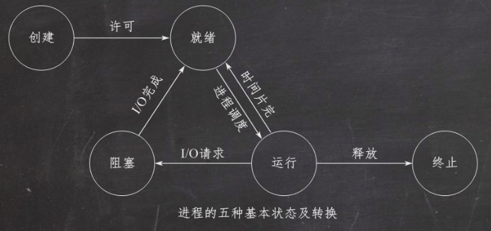
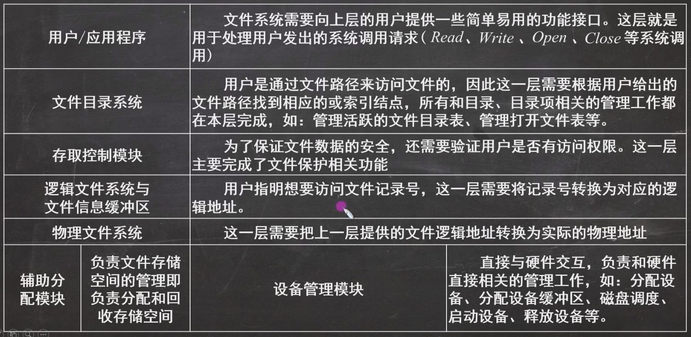
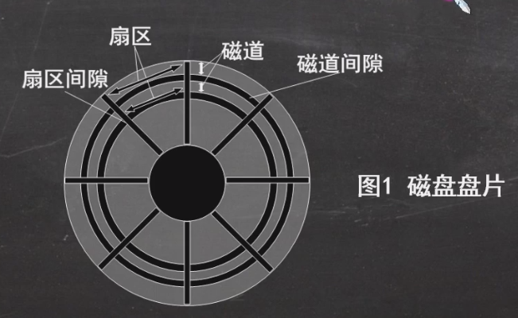
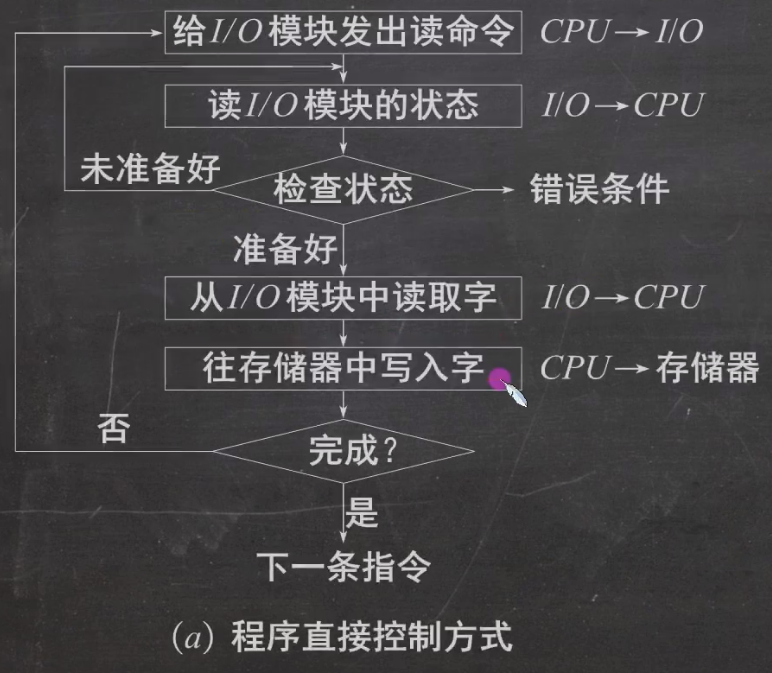
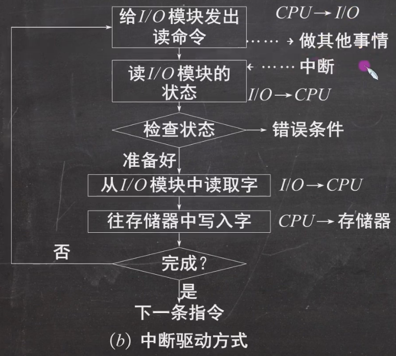

### 操作系统

- 控制和管理整个计算机系统的硬件和软件资源,并且合理组织调度计算机的工作和资源分配,提供用户和其他软件比较方便的接口和环境

#### 基本特征

- 并发:两个或多个活动同一给定时间间隔中进行
- 共享:计算机系统中的资源被多个进程共用
- 异步:进程以不可预知的速度向前推进
- 虚拟:把物理的实体变为若干个逻辑上的对应物
- **最基本特征**:并发,共享

#### 主要功能

- 计算机系统资源管理者
  - 处理机管理:进程控制 / 进程同步 / 进程通信 / 死锁处理 / 处理机调度
  - 存储器管理:内存分配 / 地址映射 / 内存保护与共享 / 内存扩充
  - 文件管理:文件存储空间管理 / 目录管理 / 文件读写管理和保护
  - 设备管理:缓冲管理 / 设备分配 / 设备处理 / 虚拟设备
- 用户与硬件系统之间的接口
  - 命令接口：作业控制方式划分
    - 联机：分时、实时
    - 脱机：批处理
  - 程序接口
    - GUI：图形用户界面
- 扩充机器
  - 覆盖软件的机器

#### 发展

- **手工操作**
  - 人机速度矛盾
- **批处理阶段**
  - 单批道处理阶段
    - 单路性、独占性、自动性、自闭性、顺序性
    - 系统资源得不到充分利用
  - 多批道处理阶段(操作系统正式诞生)
    - 多道程序并发执行,资源利用率高
    - 不提供人机交互
    - **提高系统资源利用率**
- **分时操作系统(交互性 ↑)**
  - 提供人机交互(交互性)
  - 不能优先处理紧急事务
- **实时操作系统(可靠性 ↑)**
  - 硬实时系统:必须在被控制对象规定时间内完成
  - 软实时系统:可以送一些
  - **能优先处理紧急事务**

### ''不得不知''

#### 两种指令

- 特权指令:不允许用户程序使用,I/O 指令\置中断指令
- 非特权指令:普通运算指令

#### 两种程序

- 内核程序:系统的管理者,可执行一切指令\运行在核心态
- 应用程序:普通用户程序只能执行非特权指令,运行在用户态

#### 处理及状态

- 用户态:CPU 只能执行非特权指令
- 核心态(内核态):可执行所有指令
- 用户态到核心态:中断(硬件完成)
- 核心态到用户态:特权指令 psw 的标志位(0 用户态)(1 核心态)
- **常考谁在用户态,谁在核心态**

#### 原语

- 系统最底层,最接近硬件的部分
- 程序运行具有原子性
- 程序运行时间较短,频繁调用

#### 中断和异常

- 内中断（异常）
  - 资源中断:指令中断
  - 强迫中断:硬件中断,软件中断
- 外中断
  - 外设请求
  - 人工干预

#### 系统调用

- 系统给程序员提供的唯一接口,用户态发生,核心态处理

#### 体系结构

- 大内核
- 微内核

## 进程调度

### 进程管理

- 目的:更好地描述和控制程序并发进行,实时操作系统的并发性和共享性(**进程时动态,程序是静态**)

#### 定义

- 程序的一次执行
- 程序及其数据在处理机上顺序执行时所发生的活动
- 进程是具有独立功能的程序在数据集合上运行的过程，**系统资源分配和调度的基本单位**

#### 组成

- PCB
  - 保存进程运行其期间的相关数据,**进程存在的唯一标志**
- 程序段
  - 程序代码存放的位置
- 数据段
  - 程序运行时使用、产生的运算数据

#### 特征

- 动态性：**最基本的特征 Z**
- 并发性：内存中有多个进程实体，各进程可并发执行
- 独立性：能够独立运行、独立获取资源、独立接受调度的基本单位
- 异步性：各进程各自独立，以不可知的速度向前推进
- 结构性：每个进程都由 PCB、程序段、数据段构成

#### 状态

- 两态模型
  - 运行 Running
  - 非运行 NoRunning
- 三态模型
  - 运行 Running
  - 就绪 Ready
  - 阻塞 Block
- 五态模型
  - 运行 Running:进程正在占用 cpu
  - 就绪 Ready:进程已具备运行的状态,一旦得到 cpu 就进行运行态
  - 阻塞 Block:进程不具备运行的状态
  - 创建态 New:进程正在被创建,还未加入队列
  - 结束态 Exit:进程运行结束
- 状态变化
  - 就绪 → 运行:就绪队列进程被调度
  - 运行 → 就绪:
    - 时间片轮转时间到
    - 进程被优先级高的抢占
  - 运行 → 阻塞:运行的进程因发生等待时间而无法执行
  - 阻塞 → 就绪:进程等待的事件已经完成,进入就绪队列
  - 

#### 线程

- 目的
  - 更好的使多道程序并发执行,提高资源利用率和系统吞吐量
- 特点
  - **程序执行最小单位**
  - \*\*基本不拥有任何系统资源

### 处理机调度\*

- 概念
  - 对处理机进行分配,从就绪队列中按规定算法选择进程将处理机分配给他运行,实现进程并发执行

#### 分类

- 高级调度(作业调度)(次数少)
- 中级调度(内存对换)(次数中等)
- 低级调度(进程调度)(次数多)

#### 调度方式

- 抢占
- 非抢占

#### 调度准则\*

- CPU 利用率: $\frac{利用时间}{总时间}$
- 系统吞吐量:单位时间内 cpu 完成作业的数目
- 周转时间:作业提交到作业完成的时间
  - 作业完成时间-作业提交时间
  - 平均周转时间:作业周转时间之和/作业数
  - 带权周转时间:作业周转时间/作业运行时间
  - 平均带权周转时间:带权周转时间之和/作业数
- 等待时间:进程处于等待处理机等待状态之和
- 响应时间:第一次运行- 第一次提交

#### **算法**

##### FCFS 先来先服务

先来先服务,按作业到达的先后次序来调度
算法实现简单
对长作业有利,短作业不利

##### SJF 短作业优先

以作业时间长短来计算优先级,作业越短,优先级越高
"最短的"平均等待时间和平均周转时间
必须先知道作业的运行时间
对长作业不利,会出现饥饿现象
没有考虑作业的紧迫程度

##### 优先级调度

外部赋予作业优先级,优先级高的先调度
优先级:动态\静态
优先级区分紧急程度,实时 os
可能导致饥饿现象

##### RR 时间片轮转

时间片,按照到达顺序,轮流执行时间片
响应快,适合分时 os
不能区分紧急程度,需要进程切换,消耗大

##### HRRN 高相应比优先调度

每次调度之前先计算每个进程的响应比,选择响应比高的作业调度
**(等待时间+要求服务时间)/要求服务时间==响应时间/要求服务时间**
综合考虑实现了较好的折中
增加系统开销

##### 多级反馈队列调度算法

设计多级就绪队列,优先级从高到低,时间片从小到大
每个队列都 FCFS
按优先级调度,只有第 1~i-1 队列均空,才会调度第 i 队列进程
优先级区分紧急程度
导致饥饿现象

### 进程同步\*

- 引入原因
  - 协调进程之间相互制约关系

#### 临界资源

- 一次仅允许一个进程使用的资源(打印机,共享缓冲区,共享变量,公用队列)

#### 临界区

- 每个进程中访问临界资源的程序代码
- - 进入区:检查是否可以进入临界区
  - 临界区:访问临界资源的代码
  - 退出区:解除正在访问临界资源的标志
  - 剩余区:做其他处理

#### 制约关系

- 同步:直接制约,需要在某些位置协调他们的工作次序而等待
- 互斥:间接制约关系,一个进程进入临界区使用进程资源的时候,另一个进程必须等待

#### 临界区互斥

- 原则
  - 空闲让进:空闲临界区一次只允许一个进程进入
  - 忙则等待:任何时候临界区只允许一个进程进入,其他进程必须等待
  - 有限等待:进入临界区的进程在有限时间内退出
  - 让权等待:如果进程不能进入自己的临界区,则让出 cpu,避免忙等现象

#### **信号量机制**

- wait(S)和 signal(S),即 P 操作和 V 操作
- 整型信号量
- 记录型信号量 samaphore,不存在忙等现象

#### **信号量应用\***

- 实现多个进程的互斥
  - 互斥信号量 mutex,初值为 1**进入临界区名额**
  - 每个进程将临界区置于 P(mutex)和 V(mutex)之间
  - 必须成对使用 PV
- 实现进程同步
  - 设置同步信号量 S,初值 0
  - 在前操作之后执行 V
  - 在后操作之后执行 P

### 死锁

- 原因:非抢占资源的竞争和进程不恰当推进顺序
- 定义:多个进程互相等待对方手里的资源,都处于 block 状态,无法推进的现象

#### 条件:

- 互斥:对互斥使用的资源的争抢
- 请求和保持:进程至少保持了一个资源且又提出了新的请求,且被占有
- 循环等待条件:进程资源的循环等待链,每个进程已获得的资源同时被下一个进程请求
- 不可抢占:资源未使用完之前不可被其他进程抢占

#### 解决方法

- 预防死锁
  - 破坏互斥条件:SPOOLing 技术,**很多时候无法破坏**
  - 破坏非抢占条件:新的资源申请不到,立刻释放所有资源,待需要时再重新申请
    - 实现复杂
    - 可能导致前阶段工作失效
    - 增加系统开销
    - 导致进程饥饿
  - 破坏请求和保持条件:采用静态分配方法,在进程运行前一次性申请完
  - 破坏循环等待条件
- 避免死锁
  - 防止进入不安全状态
  - **银行家算法**
- 检测死锁
  - 死锁检测算法
    - 资源分配图
      - 进程结点和资源结点
      - 进程结点 → 资源结点:请求
      - 资源结点 → 进程结点:分配
- 解除死锁
  - 资源剥夺
  - 撤销进程
  - 进程回退

## 内存管理

### 内存管理概念\*

- 定义:对内存的划分和分配

#### 功能:

- 内存空间的分配与回收:由操作系统完成,对编程人员透明
- 地址转换:使逻辑地址转换为物理地址
- 内存空间扩充:采用虚拟存储技术或自动覆盖技术
- 存储保护:保证各道作业在各自存储空间中运行,互不干扰

#### 覆盖与交换

- 覆盖:将程序分为多个段,常用的段常驻内存,不常用的需要时再调入
- 交换:处在等待的进程从内存中移到外存,把准备好的从外村换入
  - **挂起**

#### 连续分配存储管理方式\*

- 单一连续分配:内存被分为系统区和用户区
  - 系统区:位于内存低地址部分,用于存放操作系统区
  - 用户区:存放用户进程相关数据
  - 特点:内存中只有一道用户程序,用户程序独占整个用户空间
  - 优点:实现简单;无外部碎片;可采用覆盖技术扩充内存
  - 缺点:只用于单用户\单任务的操作系统;有内部碎片;存储器利用率低
- 固定分区分配:最简单的多道程序存储管理方式,将内存划分为若干个固定大小的区域,每个区域一个作业
  - 分区大小相等:缺乏灵活性,只适用一台计算机控制多个相同对象的场合
  - 分区大小不等
    - 增加了灵活性,可满足不同大小的进程需求
    - 按大小排队,有分区说明表
    - 优点:实现简单,无外部碎片
    - 缺点:
      - 用户程序太大可能无法满足需求,使用覆盖技术会降低性能
      - 产生内部碎片,内存利用率低

##### **动态分区分配**

可变分区分配,动态划分分区

###### 首次适应 FF

地址递增顺序排列,找到第一个大小满足的空闲分区

###### 最佳适应 BF

空闲区按容量递增,找到第一个能满足要求的空闲分区
**产生很多外部碎片**

###### 最坏适应 WF

按容量递减次序排列,找到第一个满足的空闲分区
**不利于后续大进程使用**

###### 邻近适应 NF

分配内存从上次查找结束的位置进行查找

#### 分页存储:非连续分配方式

- 分页式管理:将内存分成相等分区,按分区大小把进程也拆分成小部分,**不会产生外部碎片**
  - 页面和页面大小(2 的整数幂)
    - 进程中的块成为页,内存中的块成为页框/页帧
    - 外存称为块
  - 地址结构:` <pre><table>``<tr><td> `31...12`</td><td>`11...0` </td></tr>``<tr><td> `页号 P`</td><td>`页内偏移量` </td></tr>``</table></pre> `
  - 页表:为每个进程建立一个页表,记录页面在内存中对应的物理块号
    - 由页表项组成,页表项由页号和物理内存中的块号组成

> - 地址变换机构
>   - 基本地址:**设页面大小 L,逻辑地址 A 到物理地址 E**
>     - 计算页号$P=A/L$和页内偏移量$W=AmodL$
>     - 比较页号 P 和页表长度 M,若 P>M,产生越界中断
>     - 页表中页号 P 对应页表项地址:$页表起始地址F+页号P*页表项长度$,取出该页表项内容 b,即为物理快号,**页表长度是多少页,页表项是页地址占多大存储空间**
>     - 计算物理地址$E=b*L+W$
>   - 具有块表的地址变换结构 **快表:联想奇存器,存放当前访问的若干页表项(命中即访问一次,反之两次)**

#### 分段存储

- 分段:逻辑地址由段号 S 与段内偏移量 W 两部分组成
- 地址结构:` <pre><table>``<tr><td> `31...12`</td><td>`11...0` </td></tr>``<tr><td> `页号 P`</td><td>`页内偏移量` </td></tr>``</table></pre> `
- 段表:每个段表项对应进程的一段,段表项记录该段在内存中的起始地址和长度`  <pre>``<table><tr>``<td> `段号`</td><td>`段长`</td><td>`本段在主存的起始地址` </td></tr>``</table></pre> `
- 地址变换机构
  - 段表寄存器,用于存放段表起始地址 F 和段表长度 M,**逻辑地址 A 到物理地址 E 之间的地址变换**
  - 根据逻辑地址得到段号 S 和偏移量 W
  - 比较段号 S 和段表长度 M,若 S>M,产生越界中断
  - 根据段表起始地址和段号查找对应段表项
  - 检查段内地址是否超过段长,超过即越界中断
  - 访存目标空间

#### 段页式存储

- 逻辑地址:段号+页号+页内偏移量`  <pre>``<table><tr>``<td> `段号`</td><td>`页号`</td><td>`页内偏移量` </td></tr>``</table></pre> `
- 根据逻辑地址得到段号 S,页号 P 和偏移量 W
- 比较段号 S 和段表长度 M,若 S>M,产生越界中断
- 查找段表后判断页号是否越界
- 根据页号查找物理地址
- 访问目标空间

### 虚拟内存管理

- 定义:

#### 特征:

- 多次性:作业在运行时无需一次性全部装入内存,而允许被多次调入内存运行
- 对换性:无需在作业运行时常驻内存,允许作业运行时进行换进和换出
- 虚拟性:逻辑上扩大内存容量,使用户看到的内存容量远大于实际内存

#### 实现

- 请求分页存储管理
  - 页表机制
  - 字段说明:
    - 状态位 P:指示该页是否调入内存
    - 访问字段 A:记录本页在一段时间内访问的次数
    - 修改位 M:调入内存后是否修改过
    - 外存地址:指出该页在外存上的地址
  - 地址变换
- 请求分段存储管理
- 请求段页式存储管理

### **页面置换算法**

#### 最佳置换算法 OPT

选择以后永不使用的页面淘汰,最长时间内不再访问的页面淘汰
**向后看**

#### 先进显出 FIFO

选择在内存中滞留时间最久的置换

#### 最近最久未使用 LRU

选择最近最久时间未访问过的页面淘汰
**向前看**

#### 时钟 CLOCK//最近未用 NRU

循环扫描缓冲区,最近未用
换入初值为 1,访问即置零,直到第一次循环结束
第二次循环,置换为 0 的页面
**改进型 CLOCK**
增加修改位-->(访问位,修改位)

#### 比较

#### 抖动

刚刚换出的页面马上换入主存,频繁进行页面调度的行为成为*抖动*或*颠簸*
原因:某个进程频繁访问的页面数目高于可用的物理页帧数目
~~有效措施~~:撤销部分进程-

## 文件管理

### 文件和文件系统

**定义**:以计算机硬盘为载体的存储在计算机上的信息集合

- 属性
  名称、标识符、类型、位置、大小、保护、时间、日期和用户标识
- 基本操作
  创建、写、读、重定位、删除和截断
- 打开与关闭

#### 基本操作\*

- 创建文件
  - 在文件系统中为文件找到空间
  - 在目录中为文件创建条目
- 写文件
  - 指明文件名称和写入内容
  - 系统搜索目录以查找文件位置，为该文件维护一个写位置的指针
- 读文件
  - 指明文件名称和要读入文件块的内存位置
  - 搜索目录以找到相关目录项，维护一个读位置的指针

##### **重定位(文件寻址)**

- 按某条件搜索目录,将文件位置设定为给定值,并且不会读/写文件
- 删除文件
  - 从目录中找到要删除文件的目录项,使之为空项,然后回收该文件所占用的存储空间
- 截断文件
  - 文件所有属性不变,删除文件内容----->将其长度置 0 并释放空间
- 打开文件
  - 使用*Open*系统调用打开文件
- 关闭文件
  - 使用*Close*系统调用文件

#### 层次结构

### 逻辑结构

从用户观点出发看到的文件的组织方式.
文件的物理结构是从计算机观点除法看到的文件在外存上的存储组织形式

#### 流式文件

#### 记录式文件

- 顺序文件:文件中记录一个接一个地顺序存储,记录通常定长,可以顺序存储或链表存储---->顺序搜索文件
- 索引文件:建立索引表加块检索速度
- 索引顺序文件:索引表(键,逻辑地址)+顺序查找
- 直接文件/散列文件:给定键值或通过散列函数直接给定物理地址

### 文件目录

与文件管理系统和文件集合相关联的是文件目录

#### 文件控制块(FCB)

为实现目录管理,引入文件控制块数据结构

- **用来存放控制文件需要的各种信息**
- 包含:
  - 基本信息:文件名、文件物理地址、文件逻辑结构、文件物流结构等
  - 存取控制信息

#### 目录结构

- 单级目录结构：整个文件系统建立一张目录表，每个文件占用一个目录项
- 两级目录结构：文件目录和用户文件目录
- 多级目录结构：树型目录结构
- 无环图目录结构：实现文件共享

#### 索引节点

除了文件名外一切信息放入索引节点，每个文件对应一个索引结点
目录项中只包含文件、索引结点指针，因此长度大大减少

### 文件共享和保护

#### 文件共享

- 基于索引节点的共享方式（硬链接）
  - 索引结点设置一个链接计数变量 count，用于表示链接到本索引结点的用户目录项数
  - 建立时原文件和新链接的变量都+1
- 基于符号链（软链接）
  - 创建一个新的 LINK 类型文件，与共享文件同名，将该文件写入到共享用户目录中，实现用户目录与共享文件的链接
  - 建立时直接复制原文件变量且不变

#### 文件保护

- 口令保护：为文件设置口令，用户访问时需要提供口令以验证
  - 实现开销小，但一般存放于 FCB 或索引结点中，也不安全
- 加密保护：用密码对文件加密
  - 安全性高，但加密/解密需要耗费一定时间
- 访问控制：用一个访问控制表 ACL 记录各个用户对文件的访问权限
  - 实现灵活，可以实现复杂的文件保护功能

## 磁盘组织和管理\*

**结构**
由表面涂有磁性物质的金属或塑料构成的圆形盘片，通过磁头的导体线圈从磁盘存取数据

> 磁道划分为几百个扇区,一个扇区称为一个盘块
> 相邻磁道及相邻扇区通过一定的间隙分隔开,以避免精度错误
> 

### **磁盘调度算法**

一次磁盘读写操作的时间由**寻道时间**、**延迟时间**和**传输时间**决定。

#### 寻道时间$T_s$

磁头移动到指定磁道所需要的时间
跨越 n 条磁道时间、启动磁臂时间 s，$T_s = m*n+s$
m 是与磁盘驱动器速度有关的常数,约 0.2ms,启动时间约为 2ms

#### 延迟时间$T_r$

磁头定位到某一磁道的扇区(块号)所需要的时间,设磁盘旋转速度 r
$T_r=\frac{1}{2r}$

#### 传输时间$T_t$

从磁盘读出或写入数据所经历的时间,取决于每次所读写字节数 b 和磁盘转速
$T_r=\frac{b}{rN}$
**磁盘存取时间计算中,寻找时间与磁盘调度算法 有关**

#### 先来先服务 FCFS

根据进程请求访问磁盘的先后顺序进行调度

#### 最短寻找时间有限 SSTF

选择调度处理磁道与当前磁道距离最近的磁道,~~会产生饥饿现象~~

#### 扫描 SCAN 算法

磁头在当前移动方向上选择与当前磁头所在磁道距离最近的请求作为下一次服务对象,又称**电梯调度算法**

#### 循环扫描算法 C-SCAN

扫描算法基础上规定磁头单项移动来提供服务,返回时直接快速移动到起始端而不服务任何请求

> 改进:**LOOK**和**C-LOOK**,不用到达最远端,而是判定最后一个服务后返回

#### 算法比较

### 磁盘管理

#### 初始化

#### 引导快

#### 坏块

## 设备管理

### I/O 设备

**最凌乱、最具挑战性**

#### 分类

##### 使用特性

- 人交互类外部设备
- 存储设备
- 网络通信设备

##### 传输速率

- 低速设备:键盘,鼠标
- 中速设备:行式打印机,激光打印机
- 高速设备:磁带机,磁盘机,光盘机

##### 信息交换单位

- 块设备:磁盘
- 字符设备:交互式终端机,打印机

### I/O 控制方式

**控制设备和内存或处理机之间的数据传送**

#### 程序直接控制方式

从外部设备读取数据到存储器,每次读一个字的数据.
cpu 需对外设状态进行循环检查,知道确定该字已经在 I/O 控制器的数据寄存器中

> 简单易于实现,但穿行工作导致 cpu 利用率特别低
> 

#### 中断驱动方式

**允许 I/O 设备主动打断 cpu 的运行并请求服务**,使其可以向 I/O 控制器发送读命令后可以继续做其他工作

#### DMA 方式

**~~直接存储器存取~~,在 I/O 设备和内存之间开辟直接的数据交换通路**

> cpu 接收到 i/o 设备 DMA 请求后,向 io 控制器发送命令,启动 DMA 控制器,然后继续其他工作
> DMA 控制器直接与存储器交互,传送整个数据块,每次传送一个字.传送完成后,DMA 控制器发送一个中断信号给处理器

#### 通道控制方式

**专门负责输入/输出的处理机**
DMA 需要 cpu 来控制传输数据块的大小,传输的内存位置,而通道方式中这些信息由通道控制

### I/O 软件的层次结构\*

`用户层I/O软件`→`设备独立性软件`→`设备驱动程序`→`中断处理程序`→`硬件`

#### 用户层 I/O 软件

实现与用户交互的接口,用户可直接调用在用户层提供的与 io 操作有关的库函数,对设备进行操作

#### **设备独立(无关)性软件**

实现用户程序与设备驱动器的统一接口、设备命令、设备保护及设备分配与释放，同时为设备管理和数据传送**提供必要的存储空间**

> 设备独立性也称设备无关性,使设备独立于具体使用的物理设备

#### 设备驱动程序

与硬件直接相关,负责具体实现系统对设备发出的操作指令,驱动 io 设备工作的驱动程序

#### 中断处理程序

用于保存被中断进程的 cpu 环境,转入相应的中断处理程序处理,处理完并恢复被中断进程的现场,返回被中断进程

#### 硬件

包括一个机械部件和一个电子部件

### SPOOLing 技术

**外部设备同时联机操作,假脱机输入/输出操作,_独立设备改造成共享设备_**

#### 组成图

#### 输入井和输出井

- 磁盘上开辟出的两个存储区域
  输入井:模拟脱机输入时的磁盘,收容 I/O 设备输入的数据
  输出井:模拟脱机输出时的磁盘,收容用户程序的输出数据

#### 输入/输出缓冲区

在内存中开辟两个缓冲区
输入缓冲区:暂存由输入设备送来的数据,以后再传送到输入井
输出缓冲区:暂存从输出井送来的数据,以后再传送到输出设备

#### 输入/输出进程

输入进程:模拟脱机输入时的外围控制机,将用户要求的数据从输入井通过输入缓冲区送到输入井
输出进程:模拟脱机输出时的外围控制机,将用户要求的数据从内存送到输出井,待输出设备空闲,将输出井的数据经过输出缓冲区送到输出设备

#### 共享打印机

并不是真正立即把打印机分配给用户进程

- 由输出进程在输出井为其分配一块空闲磁盘块区,将要打印的数据送入其中
- 为用户申请一张空白的用户请求打印表,将用户的打印要求填入其中,再将该表挂到请求打印队列上

#### 特点

- 提高 I/O 的速度:将独占设备改造共享设备
- 实现虚拟设备功能

### 设备分配与回收

**设备分配**
根据用户的 I/O 请求分配所需设备
**原则**:充分发挥设备使用效率,尽可能让设备忙碌,避免由于不合理的分配方法造成进程死锁

> 从设备特性分:独占设备、共享设备、虚拟设备

#### 数据结构

##### 设备控制表 DCT

##### 控制器控制表 COCT

##### 通道控制表 CHCT

##### 系统设备表 SDT

#### 分配策略

##### 分配方式

###### 动态

###### 静态

##### 分配算法

###### 先请求先分配

###### 优先级高者优先

##### 安全性

###### 安全分配

###### 不安全分配
